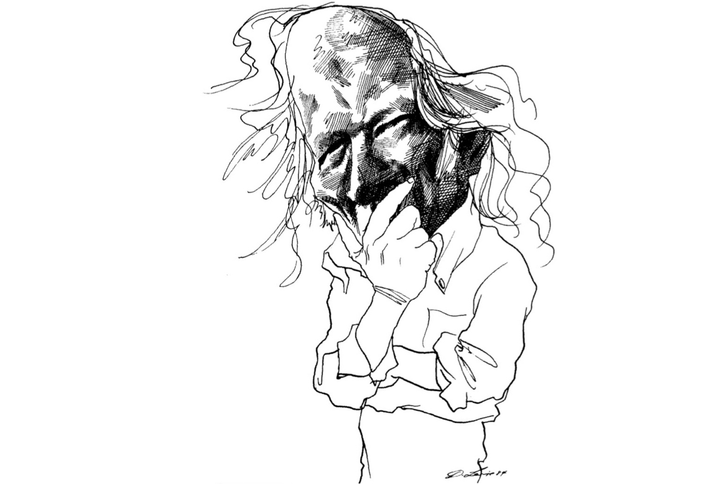

Introduction {-}
=======================================================================================

In this article I discuss Donald Davidson's critique of the Turing Test [-@Davidson:1990tt] and argue that the modified test Davidson proposes provides an operational definition of intelligence that reflects the main points of Davidson's theory of linguistic and intellectual competence.

After a short introduction to Davidson, this article is structured into three main sections:

[**Section 1**](#section1) explores Turing's original ideas and their relevance. It discusses different interpretations and versions of the Turing Test and establishes which interpretation I follow. I also discuss the significance of the test for the field of Artificial Intelligence and touch on Turing's ideas about Machine Learning.

[**Section 2**](#section2) presents and evaluates where Davidson agrees and disagrees with Turing. It also presents Davidson's modified version of the Turing Test in which the computer is judged based on observations of its learning process. I argue that this test acts as a definition for intelligence in Davidson's theory of linguistic and intellectual competence.

[**Section 3**](#section3) follows two Davidson essays which are related to his critique of the Turing Test and present a good introduction to two main points of his philosophy: the supervenience of the mental and the idea that knowledge of world, self, and others can only be acquired interdependently. Finally, I outline Davidson's empirical anti-conventionalist theory of interpretation and show how it relates to his other philosophical points to form a theory of linguistic and intellectual competence that is also expressed in his proposal for a modified test.

[I conclude][Conclusion] with a summary of the core agreements and distinctions between Davidson and Turing and a brief discussion of the relation between Davidson's ideas and the Computational theory of Mind and some implications of his ideas for Computer Linguistics.

Introduction to Donald Davidson {-}
---------------------------------------------------------------------------------------

Donald Davidson (1917--2003) "was one of the most important philosophers of the latter half of the twentieth century [...] with a reception and influence that, of American philosophers, is perhaps matched only by that of [his friend, mentor, and colleague] W. V. O. Quine" [@Malpas:2015dd, p. 1]. Davidson's philosophy is a unique and intriguing melange of analytical methods, empirical ideals, and a holistic approach to the big topics of philosophy. His thoughts are exposed through a collection of densely written essays (published from 1963--2001)[^life] which "form a mosaic out of which emerges a unified and surprisingly elegant overall view of the mind and its relation to the world. It sees our *nature as linguistic beings* as the key to the possibility of thought, to the objectivity of the world [...], and to how the mind moves us to action in a [physical] world" [@Lepore:2009d, p. 1, emphasis added].

Davidson's first renonwned work was in the Philosophy of Action, where his investigation of the causal connection between thoughts and actions [-@Davidson:1963ar] led him to an argument for the supervenience of the mental --- a position he calls  Anomalous Monism which reconciles physical substance monism with the irreducibility of the mental [-@Davidson:1970me]. In parallel he developed the argument that semantic theories for natural languages must be recursive and empirical [-@Davidson:1965tm] and that meanings and propositions could be replace by truth conditions and distal stimuli respectively [-@Davidson:1967tm]. Based on Quine's idea of Radical Translation, he developed his view of interpretation as the process of adapting a theory about both meaning and belief of the speaker based on empirical evidence [-@Davidson:1973ri]. However, he rejected conventionalism as a means by which the gap between performative and descriptive aspects of language can be bridged or the indeterminancy of meaning can be fixed [-@Davidson:1984cc], and instead put a normative Principle of Charity at the heart of the interpretative process. The theory of interpretation must be adapted for the speaker's ideolect in each situation and the social aspect of language is relocated into epistemology [-@Davidson:1994sa]. This led to his rejection of positivist and Cartesian epistemology, and his reinterpretation of knowledge of self, world, and others as interdependent [-@Davidson:1991tv]. His influential ideas about mind, language, and action are connected in his sketch of a Unified Theory [-@Davidson:1980tu] which leverages formal methods to show how an empirical theory of the rational abilities must be based on normative principles.

This empirical and fairly formal anti-reductionist account of the mind --- which does not deny the possibility of artificial intelligence and puts interpretation at the center of intellectual abilities --- is a fruitful point to reflect about the Turing Test.

[^life]:
    It is remarkable that a contemporary philosopher of Davidson's calibre only started publishing his relevant papers in his 40s after he had been a professor for over a decade. The publication dates of Davidson's papers ought to be interpreted with care though. His friend and student Ernie Lepore recounts: "[Davidson was] adventurous and daring [...] from early on right up until his death. [...] Donald was without even the slightest speck of careerism from the very start. He traveled the world giving papers in exotic places and often handed them over to local journals upon request. [...M]any of the papers were written somewhat contemporaneously. [...Some were] given much earlier than they were published and relatively around the same time. [...] I possess a mimeographed copy of his quotation paper dated from the early 60’s, long before its 1979 publication" [-@Lepore:2003me].

    Davidson's life and career are actually quite inspiring, *fascinating*, and unconventional. Davidson started out in the History of Philosophy and ventured into psychology and economy during his studies and as a professor. Certainly it is no coincidence that he was cited by continental and analytical philosophers and even computer scientists alike. To learn more about Davidson's life I recommend to read Lepore's 'Interview with Donald Davidson' [-@Davidson:2004id] and Davidson's own 'Intellectual Autobiography' [-@Davidson:1999ia]

### Historical Context

Language has been a philosophical topic since Plato, but it especially gained attention in the so-called 'Linguistic Turn' of the 20th century when it was recognized as the medium for our rational access to the world. Names like Frege, Russel, the early Wittgenstein, and the Vienna Circle stand for the earlier Ideal Language Philosophy and Logical Empiricism which hoped to solve problems of Metaphysics through a *definite logical analysis* of meaning. However, this approach did not turn out very successfully. Led by Austin, Ryle, and the late Wittgenstein, analytical philosophy paid more attention to Natural Language, focusing on the importance of *social and performative aspects*. Quine and Davidson stand at the resolution of this tension with an approach that recognizes linguistic behavior in its context while leveraging the formal methods for their analysis [@Bertram:2011sz]. Through Davidson the analytical tradition also became linkable to the 'continental' Hermeneutic traditions, contributing to the dissolution of the philosophical divide of the 20th century [@Malpas:2015dd, p. 2].

The Turing Test and Its Relevance {#section1}
=======================================================================================

Alan Turing (1912--1954) first proposed his famous test in 'Computing Machinery and Intelligence' [-@Turing:1950cm]. The thesis of his paper is that the question "Can machines think?" --- which he deemed too vague to deserve discussion --- can be replaced with the question whether a computer can pass a specified test (which is now known as the 'Turing Test'). This test is described as a game: the Imitation Game.

The Imitation Game consists of an *interrogator* who can communicate via a real-time text chat interface with two players. One player is a *computer*, the other a *human*. The interrogator’s task is to identify the human after a given period of time. The computer's task is to pretend to be a human[^no-sexism] and trick the interrogator into wrongly identifying it as the human. The human's task is to help the interrogator to make the correct identification. If many interrogators consistently[^baseline] cannot distinguish the computer from the human, the computer wins the game and passes the test [@Turing:1950cm, p. 433--434].

In the following section I discuss different interpretations of the Turing Test and establish which interpretation and version of the test I take as the basis for my discussion. Furthermore, I argue for the relevance of this interpretation of the test and work out four main claims from Turing's discussion of his test. In doing so, I specifically emphasize some of Turing's visionary ideas on how a computer must be programmed to pass the test, which have implications for Davidson's discussion of the test.

[^no-sexism]:
    I think it is pretty clear that Davidson [-@Davidson:1990tt, p. 78] misinterprets Turing when he suggests that Turing wants the computer to play the literal imitation game and pretend to be a *woman* and that the interrogator's task would be to decide on the gender. This becomes pretty clear when Turing says: "If the man were to try and pretend to be the machine [...]" [-@Turing:1950cm, p. 435] and from all his examples that are focused on how the machine can imitate being a *human* not a woman. [See also  @Copeland:2000tt, p. 526.]

[^baseline]:
    Turing's idea is that a baseline is established by the traditional imitation game, in which a man tries to imitate a woman and the interrogator has to decide on the gender. While this might not be the best way to establish a baseline, it means that Davidson's critique that "Turing does not say what he would make of a computer that was consistently chosen over the [...human] to be the [...human]" [-@Davidson:1990tt, p. 78], is ill-conceived, as the computer will unambiguously fall over or under the baseline within a margin of error.

Interpretations and Versions of the Turing Test {#test-interpretations}
---------------------------------------------------------------------------------------

The interpretation of the Turing Test is not as straightforward, as it might seem. There are three main interpretations for what it means to pass the Turing Test:

1. The Turing Test is taken as an operational definition --- a *sufficient and necessary* condition --- of intelligence[^intelligence]: Something is intelligent if and only if it passes the Turing Test. [Such an interpretation is found, for example, in @Millar:1973pi.]
2. The Turing Test is taken as a *sufficient* condition of intelligence: Something is intelligent if it passes the Turing Test. But it is not necessary for something to pass the Turing test in order to be intelligent. [@Davidson:1990tt takes this interpretation.]
3. The Turing Test is taken "as a potential source of good *inductive evidence* for" intelligence: if something passes the Turing Test one would be justified for inductively inferring that it is intelligent. [This interpretation goes back to @Moor:1976at, p. 249, 251.]

The first interpretation and any reading of intelligence in a broader sense are clearly not in line with Turing's ideas. Turing was not interested in a definition of intelligence but rather in setting a clear goal for further research. In fact I would argue that the third interpretation from Moor does Turing the most justice. This becomes fairly clear from the following section of a radio interview [-@Turing:1952ca] which represents Turing's simplest expression of the test:

> “I *don’t want to give a definition of thinking* [...] I don’t really see that we need to agree on a definition at all. The important thing is to try to *draw a line between the properties of a brain, or of a man, that we want to discuss, and those that we don’t.* […] I would like to suggest a particular kind of test that one might apply to a machine. You might call it a test to see whether the machine thinks, but it would be better to avoid begging the question, and *say that the machines that pass are (let’s say) ‘Grade A’ machines*. The idea of the test is that the machine has to try and pretend to be a man, by answering questions put to it, and it will only pass if the pretence is reasonably convincing.” [@Turing:1952ca, p. 466, emphasis added]

Turing clearly describes the Imitation Game as a test that defines a special *class of computers*, but not as one that defines thinking or intelligence. It is also implicit here that he sees the *ability to communicate* as quintessential for human-like intellectual abilities.

In the quotation, Turing also proposes a simplified version of the test, in so far as he removes the second human player. While this might be limiting for a quantitative analysis, it ensures focusing on the main question and removes any undue emphasis on strategy. Davidson proposes the same simplification in his discussion [-@Davidson:1990tt]. He goes even further in proposing that: since "we might count an object as thinking even if it were easily distinguishable from a person. [...] The interrogator [...should simply] be asked to decide whether or not the object is thinking" [-@Davidson:1990tt, p. 81]. If we assume that any bias against the object's ability to think can be removed (which makes sense for this philosophical discussion), this seems to be the clearest expression of Turing's idea. Therefore, I will follow Davidson and refer to this simplified version from here on.

[^intelligence]:
    The term 'intelligence' is adopted here purely in reference to Artificial Intelligence. Turing mostly uses the term 'thinking' and Davidson [-@Davidson:1995ct] mostly uses the term 'rationality' to refer to the concept that this thesis is concerned with. I will introduce and explicate the term 'intellectual competence' for this concept in \autoref{theory}.

Relevance of the Test and the Turing Principle {#test-relevance}
---------------------------------------------------------------------------------------

Where does this leave the relevance of the Turing Test then, if we follow Moor and interpret it merely as a framework to gather evidence for human-like intelligence? For Computer Scientists it might be *prudent* to follow Turing and ignore the philosophical question of a definition of intelligence and instead take the Turing Test as a definition of a certain class of computers. In this way the Turing Test can give a clear goal to the field of 'Artificial General Intelligence' (AGI), which is notorious for not having a clearly defined topic. Unlike other propositions for an operational definition[^agi-tests] of AGI, the Turing Test provides a clear and well-justified empirical goal. In his analysis Moor argues why the Turing Test is well apt for this:

> "There are two strong arguments why the Turing test is a good format for gathering inductive evidence. First, the Turing test permits direct or indirect testing of virtually all of the activities one would count as evidence for thinking. Secondly, the Turing test encourages severe testing. [...] The computer would be tested in detail over a wide range of subjects [...and] the interrogator's goal is to find a refuting instance which gives the computer away.” [@Moor:1976at, pp. 251--252]

Critics of the Turing Test as a goal for AGI mostly fall into two camps. The first point Moor provides is aimed against the first type of critic who suggests the test sets the wrong goal. As Moor argues, communication is a very clear framework to investigate all kinds of thinking. A further practical reason for the relevance of the Turing Test --- that I would add --- is that natural language communication provides a 'gold standard' for completely natural and seamless computer user interfaces. Many of these critics mistake the question as philosophical while it is best treated as definitional. Computer Scientists ought not to be concerned with defining intelligence in general but with a good definition for 'Grade A' computers --- to use Turing's terminology. In this regard, the interpretation of the Turing Test as a framework for gathering empirical evidence can set a clear definition of the goal of AGI.

The second type of critic questions the adequacy of the test to determine whether the goal is reached. Moor's second point is aimed against that by pointing out how well the test encourages thorough testing. The critics sometimes mistake Turing's predictions as a specification that the test ought to take only five minutes and limited implementations of the Turing Test that favor engineering tricks like the Loebner Prize[^loebner-critique] discredit Turing's intentions. I agree with Copeland's interpretation of Turing: the goal set by the test is a computer that "plays the imitation game successfully come what may, with no field of human endeavour barred, and for any length of time commensurate with the human lifespan" [@Copeland:2000tt, p. 530].

[^agi-tests]:
    See @Muehlhauser:2013wa for a brief overview of operational definitions of AGI, including the Coffe-Brewing and College Test. From a philosophical perspective all of these definitions seem rather random and dubious --- certainly much further away from clearly capturing the necessary conditions of human-like intellectual competences.

[^loebner-critique]:
    @Shieber:1994lr criticizes the Loebner Prize for its inappropriateness to award advances in natural-language-processing techniques instead of engineering tricks oriented to the exigencies of the restricted task like parrying and insertion of random typing errors. The setup of the scoring system alone shows how pointless it is to even judge current systems by a direct Turing Test. He argues that a subjective award modeled after the Nobel Prizes would make significantly more sense.

### Turing's first three main claims

Following Copeland [-@Copeland:2000tt, p. 530], we can establish the following two main claims of Turing from our previous discussion:

1. Turing sees communication as suitable to expose the relevant intellectual abilities that determine whether a computer can perform tasks on par with a human being.
2. Turing thinks that his test *specifically* can determine whether a computer possesses such communicative abilities.

But there is also a third claim which is known as the Turing Principle[^turing-thesis]:

3. Turing believes that universal computers can simulate any physical process, including the brain.

This is clearly expressed in Turing's lecture on the topic 'Can Digital Computers Think?': "if it is accepted that real brains [...] are a sort of machine it will follow that our digital computer suitably programmed will behave like a brain" [@Turing:1951cd, p. 463]. This is a much more controversial claim and --- as Turing was well aware --- he had few arguments and even less evidence for it.

It is important to highlight that this claim is not central in Turing's writing and that it is separate and fully *independent* from the other claims. Nevertheless, it is a point many philosophers have attacked. [The most famous example probably being @Searle:1980mb.] This is often tied to the misinterpretation of the Turing Test as a definition or sufficient condition for intelligence in a philosophical sense. I am not particularly interested in the discussion of this third claim here.

[^turing-thesis]:
    This is also known as the 'Church–Turing–Deutsch Principle' and represents an extension of the well-known Church-Turing Thesis to artificial intelligence.

Turing on Machine Learning {#turing-learning}
---------------------------------------------------------------------------------------

Unlike the obsession in popular culture with human-like 'Artificial Intelligence' (AI) might suggest, the interest of Computer Scientists in the last years has been more focused on so-called 'weak' AI. This refers to applying Machine Learning techniques to solve specialised problems (most notably: image recognition, domain-specific language processing, and robotics). The field that is concerned whith this is referred to as 'Artificial Intelligence' these days. The field that is concerned with human-like *strong* AI is the field of Artificial General Intelligence (AGI) which was referenced in the previous section. This shift of focus has mainly been due to a lack of success in AGI.

Turing believed that by the turn of the century there would be computers which "play the Imitation Game so well that an average interrogator will not have more than 70 per cent chance of making the right identification after five minutes of questioning" [-@Turing:1950cm, p. 442]. Recent winners of the Loebner Prize [@AISB:2015lp], which is awarded to the most human-like chatbot judged by a Turing-inspired test, show that this has not quite come to pass. On the other hand, Turing himself said that it would take "*at least* 100 years" [-@Turing:1952ca, p. 434] until a general Turing Test could be passed --- and the goal of AGI reached --- which is still well within the realm of possibility. Turing's wrong prediction of the development can be mainly accredited to his underestimation of the required processing power for Machine Learning [-@Turing:1950cm, p. 455]. Recent accomplishments in AI with deep neural networks, for example, have only just become feasible because computers are able to run networks with millions of neurons in real time.[^nn-size]

[^nn-size]:
    Steven Wolfram writes: "Computers (and especially linear algebra in GPUs) got fast enough that [...] it became practical to train neural networks with millions of neurons, on millions of examples. [...T]his suddenly brought large-scale practical applications within reach. [...] I don’t think it’s a coincidence that this happened right when the number of artificial neurons being used came within striking distance of the number of neurons in relevant parts of our brains. [...I]f we’re trying to achieve 'human-like' image identification [...] then this defines a certain scale of problem, which, it appears, can be solved with a 'human-scale' neural network." [-@Wolfram:2015ii]

### Turing's fourth main claim {#fourth-claim}

However, Turing's idea about *how* to build a computer which could pass his test are more interesting than his timeline predictions. His claim that "the problem [of building a computer that passes the Turing Test] is mainly one of programming" [-@Turing:1950cm, p. 455] still rings true today.

We have already mentioned his idea that computers should be able to simulate the brain [-@Turing:1951cd]. Indeed this reverse engineering approach to AI is the basic idea behind the neural networks which power the most successful image entity-recognition algorithms today. @Turing:1948im pioneered  this approach with his B-type unorganized machine which consisted of neurons that are trained through an 'education' process, and he proved that they were equivalent with digital computers [see @Copeland:1999at]. It is plausible that we might achieve AGI through brain simulation before we even deeply understand how the brain works.

Even more interesting is that Turing also predicted the Machine Learning approach to build intelligent algorithms and saw its non-deterministic nature as a characteristic feature:

> "Instead of trying to produce a programme to simulate the adult mind, why not rather try to produce one which simulates the child's? If this were then subjected to an appropriate course of education one would obtain the adult brain. [...] We have thus divided our problem into two parts. The child-programme and the education process. These two remain very closely connected. We cannot expect to find a good child-machine at the first attempt. One must experiment with teaching one such machine and see how well it learns." [@Turing:1950cm, p. 456]
>
> "An important feature of a learning machine is that its teacher will often be very largely ignorant of quite what is going on inside, although he may still be able to some extent to predict his pupil's behaviour. [...] This is in clear contrast with normal procedure when using a machine to do computations : one's object is then to have a clear mental picture of the state of the machine at each moment in the computation. [...] Processes that are learnt do not produce a hundred per cent certainty of result; if they did they could not be unlearnt." [@Turing:1950cm, p. 458-459]

This description is very much how modern statistical Machine Learning algorithms work. They consist of an algorithm that describes a mathematical model which is trained with human-annotated data (for example, a grammar analysis of sentences) and are then able to perform their task on similar data. [See @Schubert:2015cl for an overview about approaches to Natural Language Processing; and @Jurafsky:2015uu for a more technical introduction.] As Turing mentions, this is a paradigm shift from classical algorithms which have results that are clearly defined by the programmer and predictable independent of any training data. So we might add a fourth core claim:

4. Turing believes that the approach to devise intelligent computers should be based on learning algorithms that are trained and do not behave predictably in a classic sense.

Note that devising intelligent algorithms is a quite different task and involves techniques where an interpretation of the state of the program at each step becomes difficult or even impossible --- especially in the case of deep neural networks. And where the outcome is not just dependent on the set of rules specified in the programming but also on the 'experience' gathered by the program during its learning process. We will see later why this matters for a Davidsonian perspective.

### Summary

We have seen that a simplified interpretation of the Turing Test as proposed by @Davidson:1990tt reveals the core of Turing's idea. However, we have also seen that an interpretation of the Turing Test as an operational definition or sufficient condition for intelligence is not in line with Turing's writing. Instead, I have proposed to follow @Moor:1976at and interpret the test as a framework to collect empirical evidence to show that a computer can perform human-like tasks. We have seen that this can provide a good and clear definition of a special class of computers that are the goal of AGI research.

Furthermore, we have established that Turing claims that (1) communication abilities are representative of intellectual abilities in general and (2) that his test is adequate to evaluate those abilities. I have pointed out that his claim (3) that computers can simulate the brain (the Turing Principle) is completely independent of the other claims and not very essential.

Lastly, we have seen that Turing had pioneering ideas about how to devise algorithms which could pass his test. Such algorithms (4) need to be able to learn when trained with data and, different from classical algorithms, their outcome is not predictable independent of their 'experience' and the states of their operation are not easily interpretable.

Davidson's Critique of the Turing Test {#section2}
=======================================================================================

In this section I will first discuss the relevance of the Turing Test for the Philosophy of Mind and for Davidson specifically. I will then argue where Davidson agrees with Turing, where his criticism of Turing applies, and in how far I think this criticism does Turing justice. The section ends in an exposition of Davidson's proposal for a modified Turing Test that provides a definition for intelligence.

Relevance of Turing's Test for Davidson's\ Philosophy\ of Mind {#relevance-philmind}
---------------------------------------------------------------------------------------

I have argued that the Turing Test is misunderstood as a definition or sufficient condition for intelligence in general and merely provides a pragmatic goal for AGI research. But why should it be relevant to the Philosophy of Mind then? Davidson says "the test is designed to throw light on the nature of thought [...and it] can be applied to any object" [-@Davidson:1990tt, p. 78]. While Davidson interprets the test as a sufficient condition for thought, his statement also reveals another important aspect which is echoed by Turing:

> "The whole thinking process is still rather mysterious to us, but I believe that the attempt to make a thinking machine will help us greatly in finding out how we think ourselves." [@Turing:1951cd, p. 465]

So the Turing Test and the related task of constructing a machine which can pass it is a practical device to learn more about the nature of thought and communication. This resonates very much with Davidson's philosophy since he is following Quine's rejection of Logical Empiricism[^empiricism]: the objective of a theory of meaning for Davidson "is sought not in reductive analyses [of the meaning of expressions], but rather in showing how evidence can be marshalled in support of a theory[^theory] of interpretation for a speaker" [@Lepore:2009d, p. 9]. Philosophy is not an a priori discipline but simply a more general empirical discipline. "'Language is a social art' [...and] evidence for its acquisition and deployment must be intersubjective, and, hence, recoverable from overt behaviour" [@Lepore:2009d, p. 22--23]. Therefore the search for a definition of meaning or of intelligence itself is rather uninteresting. A definition is only relevant as part of an empirical theory that can be judged by its successful application. (We will come back to this in \autoref{davidsons-test}.) The search for a definition is, therefore, replaced by the search for an empirical theory of intelligence.

From this angle, the task of programming a machine which can pass the Turing Test seems closely related to that of devising and testing an empirical theory of intelligence, at least if we accept that the essence of such a theory could be expressed recursively. Judging a computer as passing the test is not so different from judging a person as a rational being after all. On this topic Moor argues:  

> "I believe that another human being thinks because his ability to think is part of a theory I have to explain his actions. [...] The evidence for the theory comes from the outward behavior of the person. [...] There is no reason why knowledge of computer thinking can not arise in the same way. I can use the computer's behavior as evidence in assessing my theory about its information processing." [@Moor:1976at, p. 251]

Davidson and Turing agree that we can devise a scientific theory that describes the essential parts of our linguistic competence. In the case of Turing this is evident in his believe that there is a program that allows the computer to win the Imitation Game. For Davidson it is evident in the proposal of his Unified Theory which can capture the essence of linguistic competence and rationality. However there are some important distinctions between the nature of these approaches which are highlighted in \autoref{supervenience}.

[^empiricism]:
    For historical reasons, the terminology here is easily confusing: the term 'Empiricism' ought to be treated very carefully as distinct from empirical. Davidson's theory is empirical, meaning observable evidence plays an important role in it, but it disagrees with the dogmas of Logical Empiricism (sometimes also called Logical Positivism), namely the analytic-synthetic distinction and reductionism [@Quine:1951td] and the dualism of scheme and content [@Davidson:1973vi]. Davidson replaces the concepts of meaning and proximal stimuli by a holistic and empirical theory which treats language and knowledge as elementary intersubjective [@Lepore:2009d, p. 22--23].

[^theory]:
    Davidson moved from his interest in the historic aspect of philosophy to analytical philosophy because Quine had convinced him "that it was possible to be serious about getting things right in philosophy [...and to take it] as serious as science" [@Davidson:2004id, p. 239]. But through the recession of Logical Empiricism it had become clear that this progress could not simply lie in treating philosophy as the logic of mathematics and reasoning. His experiences in studying business, working with J.C.C. McKinsey on decision theory, and studying Tarski, gave Davidson "an appreciation for what it's like to have a serious theory" [@Davidson:2004id, p. 253] and convinced him that the progress of Natural Language Philosophy could be found in looking for a pragmatic empirical theory.

### Interpretability as the essence of Intelligence

What we have discussed so far depends on accepting Turing's first claim that communication abilities are representative of intellectual abilities. As mentioned in the introduction, Davidson agrees with Turing on this point, since he "sees our nature as linguistic beings as the key to the possibility of thought" [@Lepore:2009d, p. 1], a belief springing from his metaphysics[^metaphysics] and epistemology. (I examine the latter in more detail in \autoref{triangulation}.) However, Davidson emphasizes the interrogator's judgement as the essential point. Not the computer's ability to *communicate* is essential but the fact that the interrogator can *interpret* the computer.

> "Turing was right, in my opinion, in taking as the only test for the presence of thought and meaning the interpretive powers and abilities of a human interpreter." [@Davidson:1990tt, p.86]

Davidson intentionally changes the emphasis here since he is an Interpretationist --- he holds the ability to be interpreted as not only a sufficient but a *necessary* condition for attributing thought, introspection into the working of the mind for example is *not* a sufficient condition for Davidson. (This point is discussed further in \autoref{davidsons-test} and \autoref{supervenience}.) For Davidson the essence of Turing's approach is that "instead of asking how the content of a concept [...] is thought of by the creature that has the concept [...], we ask [...] how an observer can size up the contents of the thoughts of another creature" [@Davidson:2001wt, p. 137].

The third claim (Turing's Principle) is not of particular interest to Davidson, but because of his naturalistic ontology[^ontology] he agreed that "a person is a physical object which [...] functions according to physical laws. So [...] there is no reason why an artificial object could not think [... . The real question is:] how much like us must an artifact be, and in what ways, to qualify as having thoughts?" [-@Davidson:1990ri, p. 87].

The second claim (the appropriateness of the test) is what Davidson discusses and criticizes extensively in his essay 'Turing's Test' [-@Davidson:1990tt]. The fourth claim (the importance of learning) is something Davidson does not pay much attention to, but that is closely related to his critique. (Both are the topic of the next \autoref{davidsons-critique}.)

So we have seen why *Davidson* finds Turing's Test particularly interesting. *I* have chosen his critique for discussion here since it clearly relates to Computer Science and because it "opens the way for [exploring] Davidson's own view into the nature of thought" [@Cavell:2004i, p. xvii].

[^metaphysics]:
    Davidson argues that "if we have the semantics of a language right, the objects we assign to the expressions of the language must exist" [@Davidson:1993mm, p. 40]. Since being able to communicate successfully is a sufficient condition for getting semantics mostly right acording to Davidson (see \autoref{interpretation}). This in turn also means that if we can communicate successfully, we must get it mostly right what things are in the world and in which relation they stand to each other. And this certainly seems to be a sufficient condition for intelligence. Davidson's argument for his claim that semantics is a method for metaphysics [-@Davidson:1993mm] is based on the fact that we must get things mostly right about the world, if we are intelligible as rational beings at all.

[^ontology]:
    Davidson's ontology takes only objects and events as basic entities [-@Davidson:1991tv]. He rejects the need for any propositions or proximal stimuli as entities in the mind [-@Davidson:1990mt]. The content of propositional knowledge is directly caused by the distal objects and events the world is made up of.

Davidson's Critique {#davidsons-critique}
---------------------------------------------------------------------------------------

Davidson finds Turing's Test inadequate to show that an object is thinking, not because communication is an insufficient criterion for intellectual competence for Davidson (as we have discussed), nor because a test would require an introspection into the workings of the mind. Davidson explicitly says that the test is not inadequate because it "restricts the available evidence to what can be observed from the outside" [-@Davidson:1990tt, p.83]. He finds it inadequate because it does not enable the interrogator to observe a history of three-way engagement between the object, a shared world, and other minds in which the object develops its semantics.

This is related to the "fundamental difference between semantics, which relates words to the world, and syntax, which does not" [@Davidson:1990ri, p. 94, he adopts this terminology from Tarski]. For Davidson, the essential requirement for thought or intelligence is to assign meaning to words: to relate them to the world. But he argues that the interrogator in the Turing Test cannot guarantee that the computer is able to do that:

>"The interrogator [...] has no clue to the semantics of the object. There is no way he can determine the connection between the words that appear on the object's screen and events and things in the world. Of course there must be some connection; there is no other way to account for the intelligibility of the object's English. [...But] it is perfectly possible that the connection between words and things was established by someone who programmed the object, and then provided purely syntactic connections between words for the object to wield. In this case it is the programmer who [...] has given meaning to the words [...], but the object doesn't mean anything, and there is no reason to take it to be thinking.
>
> In order to discover whether the object has any semantics, the interrogator must learn more about the connections between the output of the object and the world [...], through observing relevant causal interactions between the speaker, the world, and the speaker's audience. [...] The interrogator [must be allowed] to watch the object interact with the world." [@Davidson:1990tt, p. 83]

The interpreter can only determine *whether* the computer means something by its words if he or she can tell *what* the computer means by them. Therefore "any evidence that thinking is going on will have to be evidence that particular thoughts are present" [-@Davidson:1990tt, p. 80]. While it is clear that thoughts have caused the computer's interaction, the test framework is not giving the interrogator a chance to determine *how* any thought has come to the computer's knowledge, only *that* it has.

Davidson accredits this failure to the fact that "Turing wanted his test to draw '... a fairly sharp line between the physical and the intellectual capacities of man' [@Turing:1950cm, p. 434]. [But] there is no such line" [@Davidson:1990tt, p. 84]. Turing was wrong that the 'body' of the object does not matter. Even though the details in which the sense organs convey impressions may not matter, the existence of such organs cannot be reduced to purely textual communication. Davidson blames Turing for having a somewhat Cartesian[^descartes] approach to thought: he might not subscribe to an ontological mind-body dualism, but he tends to view thoughts as independent from sensory access to the world and only dependent on being able to communicate. Turing claims the "example of [the deaf-blind] Helen Keller shows that education can take place provided [only] that communication in both directions between teacher and pupil can take place" [@Turing:1950cm, p. 456]. He overlooks that Helen Keller for one had been able to see and hear for her first 19 months and, more importantly, only learned to communicate when her teacher correlated her signs to Helen's feeling of touch [@Wikipedia:2015hk]. So this example might actually serve more to illustrate Davidson's externalist approach to epistemology rather than underline Turing's point that communication alone is essential for thought.

The ability to interact with the world in any way and having a history of such interactions and communications about those experiences with others is essential for developing semantics. You "don't understand a language if there are not numerous connections between your use of words and experiences" [@Davidson:1990tt, p. 85]. The interrogator needs to observe the computer's history of engagement with the world in order to judge its intelligence.

[^descartes]:
    In fact, Descartes somewhat preconceived Turing's test in his 'Discourse on the Method'. He claims that machines "could never use words or other signs arranged in such a manner as is competent to us in order to declare our thoughts to others" [@Descartes:1637dm, Part V].

### Fairness of the Critique

Davidson's main critique is that Turing's idea of a sharp line between physical and intellectual abilities is ill-conceived. This leads Turing to overlook the importance of interaction in a shared world as essential for (1) *developing* thoughts and for (2) *judging* intellectual abilities.

While the second point is certainly justified, since the computer is hidden from the interrogator, the first point is debatable in light of Turing's work about Machine Learning. In his last footnote, Davidson claims that Turing "views this [learning] simply as an economical way of producing a device with mature thoughts; he does not see it as the only way" [-@Davidson:1990tt, p.86]. As outlined in \autoref{section1}, I think this is overestimating Turing's interest in presenting a sufficient condition for intelligence and underestimating his interest in actually building a certain grade of computer. Turing's ideas on Machine Learning take up a third of his essay [-@Turing:1950cm, pp. 454--460] and constitute --- as I argued --- a [fourth main claim](#fourth-claim). Most of his research from 1948--1952 was indeed not focused on the test which became so famous, but on approaches to build learning computers and simulating neural networks. None of this work mentions any other approaches for building AI. Turing actually outlines ideas on how a computer with an indexed memory can be constructed which relates past experiences to new situations using associative connections and evaluation based on reactions of its teacher and later based on self constructed norms [see @Turing:1951im, p. 257--258]. This seems closer to Davidson's requirement of having a history of interaction in a shared world than he gives credit for. So maybe classifying Turing as having a Cartesian approach to epistemology is premature.

Nevertheless, Davidson's critique of the *test* is justified since his second point is valid. In the light of our discussion of Turing's work however, our perspective might change. We should not see the inadequacy of the test as a result of Turing's underestimation of the importance of learning and interaction with the world. On the contrary, we should be surprised that Turing deemed the learning process --- which he saw as essential too --- as so irrelevant for the judegment.

Davidson's Proposal for a Modified Test {#davidsons-test}
---------------------------------------------------------------------------------------

Davidson does not simply critique the test, he also proposes a modified test:

> "The Test must be modified [...]. The object must be brought into the open so that its causal connections with the rest of the world as well as with the interrogator can be observed by the interrogator.
>
> Can the interrogator now tell what the object thinks? The answer is that it depends [...]. Let us suppose the interrogator finds that the object uses words just as he does [...and] infers (let us suppose correctly) that the object's linguistic dispositions are similar to his own in relevant ways. In the case of a person, the interrogator would be justified in assuming that these dispositions were acquired in the usual way: in the basic cases, by past causal intercourse with things and circumstances of the sort to which the person is now disposed to respond. [...] But the assumption is not justified in the case of a computer: [...] The computer which has never experienced a dog and has no memory of dogs can't mean dog by the word 'dog' [...]. Thought and meaning require a history of a particular sort. [...] Unless we [...] can observe it in action over time, we have no basis for guessing how a computer came to have the dispositions it has.
>
> It is unclear exactly what kind of history is necessary [...]. But our intuitions are clear enough in many cases. You [...] don't understand a language if there are not numerous connections between your use of words and experiences[. ...] It may seem that minds are, after all, inscrutable if no present observation of their operation can reveal what they are thinking. But of course this does not follow. [...] Even the mind of an artefact can, if it has one, be understood; it just takes longer, long enough for some history to be observed, since it cannot be inferred." [@Davidson:1990tt, pp. 84--86]

Davidson's rejection of the "sharp line between the physical and the intellectual capacities" [-@Davidson:1990tt, p. 84] should not be misinterpreted as a rejection of the possibility to devise a test at all. In his follow-up essay 'Representation and Interpretation' [-@Davidson:1990ri] he comes back to the question "what could we detach from a person and still count him or her as a thinking creature" (p. 87)? He agrees with Turing that origin, building material, and size and shape are irrelevant. Turing was on the right track with his test, he only went too far in detaching the history from a person. The ability to determine non predefined meaning --- to connect symbols with objects and events in the world --- is essential for intelligence and it depends on a rich base of experiences of causal interactions with these events and objects.

I put Davidson's explanation of the required nature of the test as follows: we may judge an object as intelligent if (and only if --- as I will argue) the object can be observed to be able to

1. successfully communicate with other intelligent beings and
2. derive its own semantics from a history of its experiences of interaction with other intelligent beings and with objects and events in a shared world.

This is what I call 'Davidson's Test'.

The ability to come up with its own semantics from a history of interaction ensures that the computer has a rich conceptual system in Davidson's holistic approach. Because "to have even one thought --- one belief or desire --- a computer would have to have a very great many other thoughts and desires. Beliefs and desires can exist only in the context of a very rich conceptual system" [@Davidson:1990ri, p. 90][^example].

We will see how well this test is an expression of Davidson's theory of linguistic and intellectual competence throughout the [next section](#section3) and specifically in \autoref{theory}.

[^example]:
    Davidson gives the following example to illustrate his point: "Alitalia Flight 19 leaves Turin for London on Tuesdays at 8:30 in the morning. We can learn this by consulting a computer; but does the computer know what we learn by consulting it? The answer is that it does not because it does not know what a flight is, where Turin is, or even that Tuesday is a day of the week." [-@Davidson:1990ri, p. 89]

### Interpretation of Davidson's Test as a Definition

Now we have a definition of Davidson's Test, but it remains to explain how it is to be interpreted. Davidson takes the Turing Test as aiming "to discover whether a sufficient condition for thought is satisfied; the condition is not claimed to be necessary" [@Davidson:1990tt, p. 81]. So we can certainly interpret Davidson's Test as a sufficient condition for intelligence. But Davidson seems to go even further:

> "The *only* way to tell if an artificial device [...] has [thoughts...] and the ability to perceive and interact with the world as a person does, is to attempt to *interpret the behavior* of the device in the same way we do the behavior of a person. [...] Understanding the program and physics of a device [...on the other hand] is *not* [...sufficient for] understanding the thought [...] of that device." [@Davidson:1990ri, p. 99, emphasis added]

It seems to me that this is interpreted correctly as the claim that Davidson's Test is supposed to provide not only a sufficient, but also a necessary condition --- and therefore constitute an operational definition of intelligence. Interpreting the behavior of a person is nothing else for Davidson than interpreting its utterances (or some other communications with semantic content). This follows from the fact that the interpretation of the semantic content of an expression requires the interpreter to have a theory about the beliefs and semantics of the person and this theory must be based on the behavioral evidence the interpreter has. We will investigate this theory of interpretation from Davidson in more detail in \autoref{interpretation}.

The second part of Davidson's claim aims to reflect an obvious counterargument that might occur. If one completely understood the inner workings of a device's or person's brain, one could certainly also judge whether it was intelligent. While Davidson does not want to deny that dissecting a person's brain might enable one to undoubtedly judge a person as belonging to the species homo sapiens and therefore be justified to infer that he or she is intelligent, this is not the kind of proof we are looking for. The test provides an *explicit* definition of intelligence, while there might be other *implicit* ways of inference about intelligence. Davidson *does* reject that any knowledge of the brain can *explicitly* proof intelligence. To illustrate this he takes the programming of a machine as an example, which I discuss in \autoref{supervenience}.

I have argued previously that the search for a definition is replaced by the search for an empirical theory in Davidson's philosophy. So if we talk about an operational definition here, this definition only becomes relevant holistically as a part of an empirical theory of intelligence --- and in Davidson's case this means a theory of interpretation.[^physics] This theory is expected to explain empirical data from interpretations, allowing us to apply it and actually yield correct interpretations of utterances, or (since the theory is not yet developed far enough for this) at least to fit with our intuitions for what is at the core of our interpretations of others. Therefore we cannot judge this definition by itself; we need to look at Davidson's theory as a whole and see whether it is a convincing empirical theory for our linguistic and intellectual competence. Then we can judge whether this definition of intelligence --- which provides the goal for the theory --- is convincing to us. Hence we will discuss Davidson's theory in more detail in the next section.

[^physics]:
    To illustrate this point, let me give an example from first semester physics: Take momentum in classical physics. (The fact that we single out the meaning of this word by attributing it as a part of the empirical theory of classical mechanics already shows that it gains its relevance from its place in this theory.) It gains its relevance from its place in this empirical theory that serves to describe the movement of mass under naturally and artificially applied forces. We cannot debate the definition of momentum (${\scriptstyle \vec{p}}$), not because it is defined in very clear mathematical terms as the time derivative of the product of mass and location (${\scriptstyle \vec{p}\;=\;\partial_t(m\cdot \vec{r})}$), but because changing its definition would destroy some of the predictive power of classical mechanics. If we would, for example, only take the simplified definition of momentum as the product of mass and velocity (which assumes the mass does not change over time: ${\scriptstyle \partial_t\! m \;=\; 0 \;\;\Rightarrow\;\; \vec{p}\;=\;m\cdot\partial_t\! \vec{r} \;=\; m\cdot \vec{v}\,}$) --- which is still very clearly defined mathematically --- we could not explain how a rocket flies which accelerates by throwing away mass (${\scriptstyle \partial_t\! m \;\neq\; 0}$); the theory of classical mechanics would lose some of its power to fit empirical evidence. This is closely related to Popper's [-@Popper:1935lf] requirement of falsifiability for a scientific theory. The definitions are only good as long as changing them would mean that the theory as a whole cannot fit some empirical evidence anymore. In this sense, their meaning and relevance is determined holistically.

### Summary

We started with a discussion of how Davidson's approach to language as a social art and interpretation as an empirical process relates to Turing's approach to intelligence, pointing out that both Davidson and Turing belief that intelligence can be described empirically and that there is a relationship between the process of building an intelligent machine and devising an empirical theory of intelligence. I have also argued that both thinkers regard linguistic abilities as essential for intelligence and agree in their affirmative answer to the question of whether artificial intelligence is possible, even though neither finds the question very interesting.

Then we learned that Davidson critiques Turing's Test for not exposing how the computer develops its own semantics from a history of experiences of interactions in a shared world. I argued that this shortcoming of Turing's design is surprising because his beliefs coincide with Davidson's, in that learning from experience is essential for developing intelligence.

In the end I gave a characterization of Davidson's Test which requires not only the observation (1) of successful communication, but also (2) of the process of deriving semantics from a history of interactions in a shared world. I argued that this test should be interpreted as an operational definition of intelligence which we can only judge in light of how empirically-convincing Davidson's theory of linguistic and intellectual competence is for which it provides the goal.

Davidson's Theory of Intellectual and\ Linguistic Competence {#section3}
=======================================================================================

The goal of this section is to relate Davidson's critique of Turing's Test to the main characteristics of his view of (\ref{supervenience}) the relation between the mental and the physical, (\ref{triangulation}) his epistemology, and ([3.3](#interpretation)) his theory of linguistic competence. We will see (\ref{theory}) how these aspects come together and how they relate to Davidson's Test and provide the background for the arguments from the previous section.

Semantics of Computer Programs and Supervenience {#supervenience}
---------------------------------------------------------------------------------------

We will investigate Davidson's view of the relation between the mental and the physical along the lines of his essay 'Representation and Interpretation' [-@Davidson:1990ri]. Davidson begins by questioning "how much like us [a computer] must [...] be, and in what ways, to qualify as having thoughts" [-@Davidson:1990ri, p.88]. As we saw in \autoref{davidsons-test}, he holds that a computer "cannot have thoughts unless it can learn and has learned from causal interactions with the world" [-@Davidson:1990ri, p.88]. So he asks "what must be added to computers [...] to insure that they are capable of thought" [-@Davidson:1990ri, p.89] --- that they know *what* they are talking about. His answer is that they must have "a very rich conceptual system" [-@Davidson:1990ri, p. 90]. Davidson's main question for the rest of the essay now becomes *how* we can judge that a computer has such a rich conceptual system. Davidson starts by ruling out that knowledge of the operation of the system is sufficient for this judgement:

> "It may seem obvious that if an artificial object thinks and acts enough like a person, someone who knows how the object was designed and built would be able to describe and explain the mental states and actions of the object. But this does not follow, for there is no reason to suppose that there are definitional or nomological connections between the concepts used by the designer and the psychological concepts to be described and explained. This should be clear if we imagine that the builder has simply copied, molecule by molecule, some real person. [...] So one sort of ‘complete’ understanding does not necessarily imply another." [@Davidson:1990ri, p. 90]

The problem is one of *mental representation*. The "representation of an object or a fact [...in] the program cannot automatically be interpreted as a representation of that object or fact *for* the device" [-@Davidson:1990ri, p. 91, emphasis added] in its 'mind'. Davidson argues that indeed the representations differ. If an object or event falls under a certain mental concept there must not be an equivalent concept in the program or in a physical description. He gives the following analogy: "Suppose, following folk advice, I am attempting to go to sleep by counting sheep. Every now and then, at random, a goat slips into the file. In my drowsy state I find I cannot remember the classificatory words ‘sheep’ and ‘goat’. Nevertheless I have no trouble identifying each animal: there is animal number one, animal number two, and so on. In my necessarily finite list, I can specify the class of sheep and the class of goats: the sheep are animals 1, 2, 4, 5, 6, 7, 8, and 12; the goats are animals 3, 9, 10, and 11. But these classifications are no help if I want to frame interesting laws or hypotheses that go beyond the observed cases, for example, that goats have horns. I can pick out any particular sheep or goat in my animal numbering system, but I cannot, through conceptual poverty, tell the sheep from the goats generally. So it may be with the mental and the physical. Each mental event, taken singly, may have (must have, if I am right) a physical description, but the mental classifications may elude the physical vocabularies" [-@Davidson:1990ri, p. 92].

The program of a computer is purely syntactic: it can give explanations of its concepts in terms of other concepts it has, but it cannot specify anything about semantics, about the references of its concepts: the relationships between concepts and objects or events in the world. "There is the language in which each animal can be picked out, but which lacks the concepts needed for classifying the animals as sheep or goats; similarly, syntax can provide a unique description of each true sentence, [...] but it can't classify sentences as true or false. [...] If we knew no more than the program, we would have no reason to say [...] that any aspect of or event in the device represented anything outside the device" [-@Davidson:1990ri, p. 91]. Physics works the same way, when it appeals to strict laws. Such strict laws are only "drawing on concepts from the same conceptual domain and upon which there is no improving in point of precision and comprehensiveness. [...] Physical theory promises to provide a comprehensive closed system guaranteed to yield a standardized, unique description of every physical event" [-@Davidson:1970me, p. 223--224]. Just like the program a complete physics is precise and contains no ceteris paribus (other things being equal) clauses in its explanations and it does not appeal to any concepts outside of its realm.[^qm-observers] Therefore its semantics, its relationship to the world, is not given in the physical model or theory itself. Only our interpretation of physics gives its terms a semantic. This is realized through experimental practices in which we compare the predictions of the model to our observations using set standards.[^units] We can try to describe the procedures of experiments as precisely as possible but not in the vocabulary of physics. They will always contain instructions in mental terms.

This is different for theories involving mental events, where "an event is mental if and only if it has a mental description [...that involves terms like believing, intending, desiring, knowing, perceiving, remembering, and so on;] the distinguishing feature of the mental is [...] what Brentano called intentionality" [-@Davidson:1970me, p. 211]. Mental properties are dispositional predicates which are causal in nature: "if Cain killed Abel, he must have done something that caused Abel's death, and if he killed Abel intentionally, he must have been caused to act by a desire for Abel's death. Beliefs, desires, and intentions are themselves causal dispositions" [-@Davidson:1990ri, p. 95]. Such causal dispositions do not appear in physics: "it is a sign of progress in a science that it rids itself of causal concepts. The dissolving of some salt is explained, up to a point, by saying that salt is soluble and this salt was placed in water; but one could predict the dissolving on the basis of far more general knowledge if one knew the mechanism, what it is about the constitution of the salt that accounts for its dissolving. When the mechanism is known, the explanation will not call on the causal concept of solubility" [-@Davidson:1990ri, p. 96]. This is also related to the semantical nature of our mind. In "specifying the contents of a memory, [we are forced] to refer to causes normally outside the person, [...giving] a causal explanation of a belief [...and] a semantic interpretation of it" [-@Davidson:1990ri, p. 96]. In this way mental representation is externalistic, it refers to terms outside of its descriptive scope.

So we saw that physics and programs provide comprehensive theories that are purely syntactical and thus refer to no external concepts which allow them to be expressed in strict laws which eliminate causal dispositions. We saw that mental concepts on the other hand are semantic in an essential way and are expressed as causal dispositions and that such causal dispositions need to be eliminated to describe something in a complete physics as strict laws. Thus we can conclude that mental predicates cannot occur in strict laws [See @McLaughlin:2013am, p. 417-423]. This is what Davidson calls the *anomalism of the mental*: "There are no strict [...] laws on the basis of which mental events can be predicted and explained" [@Davidson:1970me, p. 208].[^turing-rules]

But --- despite what @McLaughlin:2013am seems to suggest --- this is not the final argument Davidson has in mind. Externalism, ceteris paribus laws, and causal dispositions "could also be said to distinguish the concepts of many of the special sciences such as biology, [...where] there must be something more basic or foundational" [@Davidson:1991tv, p. 217] to the anomalism of the mental. Otherwise we would assume that "knowledge of the program of a device that successfully mimics the workings of the mind, will explain the mechanisms that support or constitute thought" [@Davidson:1990ri, p. 96--97] just like physics can explain the causal disposition of solubility.

> "It is only when we can see a creature (or 'object') as largely rational by our own lights that we can intelligibly ascribe thoughts to it at all [...]. This means that when anyone [...] ascribes thoughts to others, he necessarily employs his own norms in making the ascriptions. There is no way he can check whether his norms are shared by someone else without first assuming that [the other is intelligible and] in large part [...his norms] are [...shared.] If the subject under study is to remain [as having] thought and intelligence, a normative methodology cannot be  avoided." [@Davidson:1990ri, p. 97--98]
>
> "We depend on our linguistic interactions with others to yield agreement on [...] the sort of structures in nature that allow us to represent those structures in [...] numbers. We cannot in the same way agree on the structure of the sentences or thoughts [...], for the attempt [...] sends us back to the very process of interpretation [...]. It is here, I suggest, that we come to the ultimate springs of the difference between understanding minds and understanding the world as physical. A community of minds is the basis of knowledge; it provides the measure of all things. It makes no sense to question the adequacy of this measure, or to seek a more ultimate standard." [@Davidson:1991tv, p. 218]

The interpretation of mental concepts is essentially normative; it requires us to assume a basic shared understanding of the world, without which we cannot interpret others. We must assume others are largely coherent in their thoughts and corresponding to the same stimuli in the world as we are. This irreducibly normative character does not appear in physics or programs but it is this character which allows us to render any intelligible picture of the world. Physics and programs cannot give an account of their semantics, only our evaluation of their predictive powers through experiments puts them in relation to the world. The concept of causality allows us to bridge the gap between these explanatory schemes. Its causal looseness is necessary to overcome the distance between the normative and formal explanations [see -@Davidson:1990ri, p. 98]. The ability to put things in relation to the world only emerges through our communication with others (we will discuss this more in the next \autoref{triangulation}). The mental is irreducible in so far as it constitutes the basis of our very ability to make the world intelligible through such communication about a shared world.

[^qm-observers]:
    This is assuming a complete physics of the world, which the practical science of physics strives to reach. In the science of physics of course there are still many issues like the inability of quantum mechanics to define in physical terms what an observation is that leads to the collapse of the wave function. But the fact that this is seen as a huge deficiency of the theory by most physicists illustrates this description of a complete physics --- independent of whether it is achievable or not.

[^units]:
    Units are the bridges between the variables in the physical model and our observable reality. Their definitions give a semantics to the model. But there definitions are externalistic. This becomes clearest if we look at the definition of the basic SI unit 'kilogram' which is currently still defined by a weight lying in a vault in Paris --- not by the number of atoms of it, but by the object that we can *use* in comparative experiments.

[^turing-rules]:
    In his section 2.(8) about the 'Argument from Informality of Behaviour' Turing discusses a somewhat related argument that there is no "definite set of rules of conduct" [-@Turing:1950cm, p. 452] which govern the behavior of a person and that therefore a deterministic computer could not simulate a person's behavior. As Turing points out this argument (which he is not deriving directly from any other literature, but establishing himself in this crude way) fails because it is beside the point and has no evidence for its claim. But unlike Oppy and Dowe [-@Oppy:2011tt, p. 21, a fairly poor entry in the Stanford Encyclopedia of Philosophy] suggest the argument could easily be made strong if we suppose a mind-body dualism, causal influence of the mind on the body, and one of the various arguments like the one given here that there are no strict rules governing mental processes.

### Supervenience and Anomalous Monism

We saw that Davidson argues at length for the anomalism of the mental --- mental events do not appear in strict laws and are thus irreducible to the physical. But we also already saw that Davidson agrees with Turing that brains might act similarly to computers and that it should be generally possible to make thinking computers. In fact, Davidson rejects any Cartesian mind body-dualism, as "the mental and the physical share *ontologies*, but not [...] classificatory concepts" [-@Davidson:1990ri, p. 92].[^spinoza] Davidson labels this combination of ontological monism and the principle of the anomalism of the mental *Anomalous Monism* [-@Davidson:1970me]. This view rests on the type-token-distinction that "each particular mental event [token] is identical with a particular physical event [token, but...] there are no strict psychophysical laws [...and therefore] no mental event type is a physical event type" [@Lepore:2009d, p. 17].[^fodor] So while the behavior of each event can be completely explained on a physical level --- since mental event tokens are identified with physical event tokens, which are governed by strict laws --- the physical explanation or the understanding of the program does not offer any insights for a mental explanation --- since the physical event tokens do not fall under any mental event type. "Knowing the program is enough to explain why the device produces the marks or sounds or pictures it does given an input described in similarly abstract terms. This knowledge does not touch on questions [...] of reference to the outside world" [@Davidson:1990ri, p. 93]. To make sense of the explanation by relating it to the world we need a mental scheme.

> "Anomalous monism resembles materialism in its claim that all events are physical, but rejects the thesis [...] that mental phenomena can be given purely physical explanations. [...] Although the position I describe denies there are psychophysical laws, it is consistent with the view that mental characteristics are [...] dependent, or supervenient, on physical characteristics. Such supervenience might be taken to mean that [...] an object cannot alter in some mental respect without altering in some physical respect. Dependence or supervenience of this kind does not entail reducibility through law or definition" [@Davidson:1970me, p. 214]

Davidson's idea of the supervenience[^supervenience] and irreducibility of the mental to the physical has been highly discussed[^discussion] and was, and still is, very influential. As mentioned before, it also provides the basis for the claim that "the only way to tell if an artificial device [... can think], is to attempt to interpret the behavior of the device [...because] interpretation involves the use of normative concepts [... which] have no role in the understanding of a syntactically specified program" [-@Davidson:1990ri, p. 99]. So a behavioral test like Turing's or Davidson's Test is a necessary condition to judge anything as intelligent, be it a person, a non-human animal, or an object.

[^spinoza]:
    Davidson argues that 'Spinoza's Causal Theory of the Affects' [-@Davidson:1999sc] might be interpreted as a form of anomalous monism.

[^fodor]:
    Another famous argument against reductionism by @Fodor:1974ss also relates to the fact that a special science type has multiple realizations through physical tokens, but those will fail to establish any physical type predicate at least in most cases.

[^supervenience]:
    The modern use of the term supervenience actually originates from 'Mental Events' [@Davidson:1970me, p. 214]. "This is the first explicit statement of a psychophysical supervenience thesis in the literature" [@McLaughlin:2013am, p. 427, see also p. 438].

[^discussion]:
    Davidson's 'Mental Events' [-@Davidson:1970me] has been a very influential and highly discussed paper. For an introduction to some main discussions around Anomalous Monism about mental and physical taxonomies and event individuation, strict laws and completed physics, Ramsification, strong and weak supervenience, and type epiphenomenalism and the cause law principle see @McLaughlin:2013am.

Triangulating Knowledge of a Shared World {#triangulation}
---------------------------------------------------------------------------------------

As in the previous subsection, we are going to examine Davidson's epistemology from a discussion which departs from another question arising from Turing's Test. This time, it is not the question of *how* we can judge the computer, but *what* it is that would make a computer think. Davidson takes this route in his essay 'What Thought Requires' [-@Davidson:2001wt]:

> "So we need to ask what would turn calculation, in the sense in which [...] a computer can calculate, into thought? [...] Some non-human animals can learn a great deal, but they do not learn that something is true. [...Only] a creature with propositional attitudes is equipped to fit a new concept into a complex scheme in which concepts have logical and other relations to one another. [...] Some degree of holism goes with having concepts.
>
> The fundamental distinction [lies] between a mindless disposition to respond differentially to the members of a class of stimuli, and a disposition to respond to those items *as* members of that class. [...] A creature that cannot entertain the thought that it may be wrong has no concepts, no thoughts. To this extent, the possibility of thought depends on the idea of objective truth, of there being a way things are which is not up to us. [...] What is needed is something that can provide a standard against which an individual can check his or her reactions, and only other individuals can do this. Adding a second person helps [...to pick out the relevant cause and to explain error]. It narrows down the relevant cause to the nearest cause common to two agents who are triangulating the cause by jointly observing an object and each other's reactions. The two observers don't share neural firings or incoming photons; the nearest thing they share is the object prompting both to react in ways the other can note. [...] Triangulation also creates the space needed for error, not by deciding what is true in any particular case, but by making objectivity dependent on intersubjectivity." [@Davidson:2001wt, p. 138--137, 141--143]

Davidson answers the question about what distinguishes our ability to think from the ability to simply do very complex tasks, like computers, with the fact that we have concepts that occur in a holistic way. Moreover, it is the concept of error that is the key to thought. The concept or error allows us to distinguish between pure conditioned responses (which cannot be wrong, just like the calculations of a computer) and the right application of a concept. This requires semantics for a language which can distinguish between what we think and what actually is in the world. The core of the concept of semantics is the truth predicate: the idea that our thoughts and sentences can be true *or false*. This is also called the idea of objective truth --- a truth that lies beyond ones own judgement. This is the quintessential question of Natural Language Philosophy raised by Wittgenstein: "what is the difference between using words correctly and merely thinking that one is using them correctly?" [@Davidson:1994sa, p. 116].

Wittgenstein's own answer to this question --- from his famous argument against the possibility of a private language [-@Wittgenstein:1952pu, $\!$ 256--282] --- is that language necessarily has a social aspect without which semantics cannot be explained. Davidson's ideas relate to this. His essential argument is that to make the distinction between true and false beliefs, a social background is required. We can only call our own concepts into doubt if we hear different opinions.[^autism] The social norm that solves the problem is not given by conventions or shared practices, but by correlating reactions to a shared environment through a communication process.

> "As Wittgenstein says, by yourself you can't tell the difference between the situations seeming the same and being the same. [...] If you and I can each correlate the other's responses with the occurrence of a shared stimulus, however, [...] it provides each of us with a ground for distinguishing the cases in which it fails. Failed natural inductions can now be taken as revealing a difference between getting it right and getting it wrong [...]. A grasp [...] of the distinction between thinking something is so and its being so, depends on the norm that can be provided only by interpersonal communication" [@Davidson:1994sa, p. 125]

Moreover,[^two-arguments] Davidson argues that not even a physicalist account of thought can achieve this since it cannot solve the problem of the inscrutability of reference [@Quine:1960wo, ch. 2] --- the unclarity about the relevant causal origin of a concept (the object, the light, the stimulated neurons, etc.). Davidson solves the problem by locating "the relevant cause of a speaker's thought [...] at the intersection of the two lines that can be drawn [...from] the speaker [...and] the interpreter [...to] the object or event in the world they are responding to and communicating about" [@Bernecker:2013te, p. 445]. Davidson fittingly calls this process of finding the intersection in the world between two points of view *triangulation*.

Since triangulation identifies the relevant cause of a thought in the distal stimulus in the world rather than in a proximal stimulus in our head [see @Davidson:1990mt], it is a type of externalism. Different from Putnam's [-@Putnam:1975mm] physical externalism and Burge's [-@Burge:1979im] social externalism which try to identify the semantics of certain types of mental content and which Davidson rejects [-@Davidson:1987ko, -@Davidson:1994sa], his externalism is not concerned with the contents of any specific thoughts, but claims that interaction in a shared world is a necessary condition for having thoughts at all. This externalism has therefore been labeled *transcendental externalism* [@Bridges:2006dt, p. 291].

[^autism]:
    Some have argued that autistic speakers show that having the idea of objective truth and interpreting others is not essential for the ability to think and speak. There is empirical evidence that "autistic speakers allegedly fail false belief tests, which are designed to test their ability to attribute false beliefs to others [...and] actual cases of autistic speakers not capable of attributing beliefs to others have reportedly been found." Since those autists are clearly capable of language and thought, it is argued that the social aspect of language is unnecessary. It remains very unclear how convincing the evidence from such tests is and what alternative picture of language without a social environment and the idea of objective truth could possibly look like.  [For a brief introduction to the discussion and overview of the literature, see @Verheggen:2013t, p. 466, 469.]

[^two-arguments]:
    It has been suggested that two main arguments for triangulation can be extracted from Davidson's writing. The first one, "the argument from error", is the one trying to solve the origin of the idea of objective truth which I have just sketched; the second, the "argument from object-directedness", tries to solve the problem of the inscrutability of reference which I am about to outline now [@Bridges:2006dt, p. 292]. My aim here is not to reconstruct these arguments, but to plausibilize Davidson's triangulation idea. For an introduction to some of the main problems of Davidson's arguments see @Bernecker:2013te and @Bridges:2006dt and for some defenses see @Verheggen:2013t.

### Three Varieties of Knowledge

This triangulation process is Davidson's epistemology. It can be captured as a relationship between three types of knowledge: knowledge of the contents of one's own mind (subjective), knowledge of the contents of other minds (intersubjective), and knowledge of the world (objective). All three types of knowledge differ: other than the knowledge of one's own mind, knowledge of the world and other minds "depends on the functioning of [one's] sense organs, and this causal dependence on the senses makes [one's] beliefs [...] open to a sort of uncertainty" [@Davidson:1991tv, p. 205]. Knowledge of the world is often "simply caused directly by the events and objects [...]. But [...] knowledge [...] of other minds is never immediate in this sense" [-@Davidson:1991tv, p. 205] it is only accessible through interpreting their behavior. The "three varieties of knowledge are concerned with aspects of the same reality; where they differ is in the mode of access to reality [..., but how can] the same world [be] known to us in three such different ways" [-@Davidson:1991tv, p. 205, 208]? This question lies at the heart of what Davidson identifies as the three main questions of epistemology: How can the mind have (1) knowledge about the natural world and (2) the content of other minds, and how can one (3) know the content of one's own mind without resorting to evidence? [-@Davidson:1991tv, p. 208]

The first two questions stem from the Cartesian idea that knowledge of my own mind has conceptual priority over the other types of knowledge which leads to skepticism. The third question is raised by the positivists who answer it by reducing all knowledge to knowledge of world. But both accounts fail, since the three types are irreducible and none has conceptual priority. With Davidson's answer of triangulation, all three questions are answered simultaneously. The content of propositional knowledge is directly caused by the objects and events of which the world is made up. We come by this content through triangulating between our stimulus and that of another person caused by the same object or event in our shared world. We have access to other people's stimuli only through interpretation of their (often verbal) reactions to those stimuli. Therefore, all three types of knowledge are interdependent and none has priority above the others: my propositional knowledge (3) is dependent on interpretation of reactions to stimuli from a shared world; knowledge about someone else's propositions (2) must be gauged by my own propositional knowledge; and knowledge about the world (1) is only possible through interpersonal communication.[^circularity] The three form a triangle of interdependence. This leads Davidson to a denial of Cartesian skepticism and positivist behavioral reductionism.

> "Until a base line has been established by communication with someone else, there is no point in saying one's own thoughts or words have a propositional content. [...] The triangulation which is essential to thought requires that those in communication recognize that they occupy positions in a shared world. So knowledge of other minds and knowledge of the world are mutually dependent.
>
> [...] Attributing thoughts to others is a matter of matching the verbal and other behavior of others to our own propositions [...]. Knowledge of our own minds and knowledge of the minds of others are thus mutually dependent. [...]
>
> The nature of interpretation guarantees both that a large number of our simplest perceptual beliefs are true, and that the nature of these beliefs is known to others. [...] Any particular belief [...] about the world around us may be false. What cannot be the case is that our general picture of the world and our place in it is mistaken, for it is this picture which informs the rest of our beliefs and makes them intelligible [...]." [@Davidson:1991tv, p. 213]

Let us turn to the last conclusion Davidson draws here. Interpretation is under-determined: to know whether a speaker holds a sentence true or not, we need to know what he means by it, which requires us to triangulate, which in turn only works if we can determine whether he holds the sentence true. To break this circle we have to appeal to a norm of communication. Davidson claims that only an interpersonal standard of consistency and correspondence (sometimes also called *Principles of Charity*) can achieve this. "The principle of coherence prompts the interpreter to discover a degree of logical consistency in the thought of the speaker; the principle of correspondence prompts the interpreter to take the speaker to be responding to the same features of the world that the interpreter would be responding to under similar circumstances" [-@Davidson:1991tv, p. 211]. The former ensures that a holistic interpretation is possible and the latter allows us to create the bridge of triangulation between beliefs and references. These principles are essential for interpretation and therefore also for knowledge. They make it "constitutive of what it is to be a speaker that one is mostly right about the external world, one's own thoughts, and what one's words mean. The importance of this conclusion can hardly be overemphasized. If it is right, then we have a transcendental guarantee of knowledge of our own minds, the minds of others [...], and the external world. We secure this without having to explain how it is that we justify our beliefs on the basis of evidence, for knowledge in each of these domains emerges as a fundamental condition on having the capacity to speak and think at all" [@Lepore:2009d, p. 20].

Understanding the importance and function of triangulation makes it clear why communication without interaction in a shared world does not allow us to say much about how a speaker understands. Only through observing the interdependent three-fold  relationship between interpreter, speaker, *and the world* can we tell anything about the semantics of a speaker. Davidson's emphasis in his test on the importance of observing the computer interact in a shared world in order to judge its intelligence is rooted in this conviction about epistemology.

[^circularity]:
    Some have argued that Davidson's account of thought in triangulation is circular since language presupposes thought [for example see @Bernecker:2013te, @Bridges:2006dt]. Davidson himself is "under no illusion that [he] can provide anything like an analysis; [...] for a non-circular answer would tell us how to account for intensionality in non-extensional terms" [@Davidson:1997sl, p. 139] which he sees as impossible as we have seen in \autoref{supervenience}. Nevertheless the account is instructive. "It is obviously not just the narrow vicious circle that says that there is language and thought only when there is language and thought. It is rather the rich and complex circle that encompasses language, thought (each of which depending on there being fixed meanings), possession of the concept of objective truth, and linguistic triangulation. I should say it is an instructive circle, each part of which is such that, if it is absent, the whole circle breaks down. [...Therefore] it seems to me that the story is compelling and that within the intensional realm, progress has been made" [@Verheggen:2013t, p. 468]. So the critique is somewhat beside the point. The relevance of any theory does not follow from its ability to reduce terms but from its ability to account for empirical data (otherwise String Theory would be accepted). Davidson's account is relevant because it fits well with many of our experiences how we gain knowledge and is therefore an attractive alternative to Cartesian idealism or positivist reductionism.

From Prior to Passing Theories of Interpretation {#interpretation}
---------------------------------------------------------------------------------------

Now we finally come to the heart of Davidson's philosophy: his theory of interpretation. I first give an outline of the main idea of the theory and then discuss its anti-conventionalism and the formalizations Davidson proposes and how these seemingly very different accounts fit together and form his picture of a science of rationality.

Davidson's interest lies not in "the (empirical) question how we actually go about understanding a speaker [...but in] the (philosophical) question what is necessary and sufficient for such understanding" [@Davidson:1994sa, p. 111]. He does not aim to give a full account of how we interpret others in everyday practice nor "to provide useful hints to real linguists, or to criticize their methods [...or] yield an insight into [...] first-language acquisition" [-@Davidson:1995ct, p. 131]. He is concerned with the essence of our linguistic abilities that allows us to interpret propositional content and gets to the core of what our mind can do. I adopt the term *linguistic competence*[^linguistic-competence] as opposed to *linguistic performance* to refer to this. A theory of linguistic competence is a model that can give an account of how interpretation of propositional contents of others can be described under some idealized conditions. In his early writing, Davidson refers to this using the term 'Radical Interpretation' [-@Davidson:1973ri], which derives from Quine's account of radical translation [@Quine:1960wo]: a *hypothetical* situation in which an interpreter figures out how to understand the previously completely unknown 'language' of an unknown speaker (similar *but idealized* to the task of a linguist learning a native's language). This account of interpretation without any previous knowledge of how to proceed is what gets to the core of linguistic competence according to Davidson. (It is important to note again that this is not about *acquisition* but about *description* of linguistic competence.)

The core of Davidson's theory is that the process of interpreting utterances can be described by a theory that yields an interpretation for each utterance of the speaker which can be expressed in the interpreter's own language. To understand someone we need to 'translate' his utterances into our own vocabulary. It becomes clear that some 'translation' is necessary even if we speak the same 'language' when we recognize that no two people assign exactly the same interpretations to all their words, so no two people will simply share the understanding of all their utterance, because they share a 'language'. Everyone speaks his own idiolect, which is interpretable (unlike a private language).[^language] What happens in the process of understanding each other is described by Davidson as the convergence of two speakers' prior theories of interpretation into a passing theory of interpretation. The prior theory of interpretation of the interpreter is what he comes equipped with to interpret this particular speaker and for the speaker it is what informs his way of talking to this specific interpreter. The passing theory is what they converge on in their understanding that allows them to interpret the utterance in the same way.

> "I have distinguished [...] the prior theory from [...] the passing theory. For the hearer, the prior theory expresses how he is prepared in advance to interpret an utterance of the speaker, while the passing theory is how he *does* interpret the utterance. For the speaker, the prior theory is what he believes the interpreter's prior theory to be, while his passing theory is the theory he *intends* the interpreter to use." [@Davidson:1986nd, p. 101]

Sometimes the speaker's and interpreter's prior theories of interpretation for a sentence might already converge, but very often we need to do some mental work to arrive at a shared passing theory. (You might take any sentence which you do not understand instantly as an example.) Therefore, *radical* interpretation of sorts is quite common in everyday communication. So what does it mean to have the same passing theory for an utterance? It means that we assign the same meaning to an utterance. For Davidson this is true if the same truth conditions would be assigned to the utterance by speaker and interpreter [see -@Davidson:1965tm, more on this later].

Davidson's main question is not how we get a prior theory of interpretation in the first place (he assumes that we have some linguistic ability already), but how we converge on a passing theory of interpretation. "Linguistic ability is the ability to converge on a passing theory" [-@Davidson:1986nd, p. 107] of interpretation. Therefore, to account for linguistic competence we must have a meta-theory that describes how to transition a prior into a passing theory. This is where Davidson's holism comes in: we need to appeal to propositional attitudes like believe, preference, and intention to interpret a speaker. Davidson's description of such a meta-theory has two steps: in the first step we determine the syntax and logical form based on simple preferences and patterns. In the second step we determine the meanings of simple expressions through triangulation in a shared environment and then from there find the meanings of complex concepts. It is important not to misunderstand Davidson as claiming that speakers or interpreters use theories to literally translate each other: "the point is not that [a] speaker or hearer *has* a theory, but that they speak and understand *in accord with* a theory --- a theory that is needed *only* when we want to *describe* their abilities" [-@Davidson:1994sa, p. 113, emphasis added].

Because of the distributed nature of Davidson's work, the reconstruction of his theory of interpretation is a bit cumbersome and has been a topic of controversial debate. Two of the most prominent traits of his theory that appear in his early and late essays are the rejection of meanings as entities sui generis or as expressions in a language of thought and an accompanying anti-conventionalism which holds that no rules known to the speaker and hearer in advance can be enough to converge on a passing theory. As we have seen in the previous section about triangulation --- Davidson holds truth and communication as the elementary concepts which make meaning and conventions circumstantial. Nevertheless he thinks that interpretation can be treated with formalisms in a serious empirical scientific manner. In the following I discuss how these views fit together.

[^linguistic-competence]:
    The term 'linguistic competence' was introduced by Chomsky who makes a "fundamental distinction between competence (the speaker-hearer's knowledge of his language) and performance (the actual use of language in concrete situation)" [@Chomsky:2014at, p. 4]. While Davidson criticizes the idea of linguistic competence as knowledge of a language, he adopts the term for the description of the interpreter's essential competence that enables communication in 'A Nice Derangement of Epitaphs' [-@Davidson:1986nd].

[^language]:
    Davidson has become famous for claiming "that *there is no such thing as a language* [...]. We must give up the idea of a clearly defined shared structure which language-users acquire and then apply to cases." [-@Davidson:1986nd, p. 107, emphasis added]. Our discussion should illuminate what he means by that. Of course he does not argue that the word 'language' is meaningless. He says "speakers share a language if and only if they tend to use the same words to mean the same thing[. Which leaves...] defining a language as the philosophically rather unimportant task of grouping idiolects" [-@Davidson:1994sa, p. 111]. Neither does Davidson claim that we literally translate others, he only draws an analogy between interpretation and translation, but very intentionally changes Quine's terminology from 'translation' to 'interpretation'.

### The Social Aspect of Language beyond Conventions

In 'Communication and Convention' [-@Davidson:1984cc] Davidson examines the relation between meaning and use of language for communication. Since Austin [-@Austin:1956pu] pointed out that speech acts have not only a *descriptive* character but also a *performative* character that *changes* the state of the world, a main topic of Natural Language Philosophy has been to describe how those two aspects are related. A common way to explain this relation is to appeal to conventions. Following @Austin:1962hw, Davidson distinguishes between three aspects of an utterance: *locution* (literal meaning), *illocution* (intended meaning), and *perlocution* (ulterior purpose) [-@Davidson:1984cc, p. 272]. He argues against the proposal that the relation between literal meaning and propositional attitudes (like purpose and intention) can be established by appealing to conventions. "Grammatical mood and illocutionary [and perlocutionary] force, no matter how closely related, cannot be related simply by convention. [...] Convention [cannot] link what our words mean --- their literal semantic properties, including truth --- and our purposes [and intentions] in using them" [-@Davidson:1984cc, p. 271].[^liar-argument]

We should not be surprised by Davidson's anti-conventionalism since we have already seen that he rejects the idea that knowledge of other minds is reducible. But trying to explain illocution and perlocution (which depend on propositional attitudes) with conventions in terms of the grammatical mood and meaning is trying to reduce knowledge of other minds. This becomes pretty clear if we look at attempts in Natural Language Processing to determine linguistic conventions from texts to help a computer communicate without having any other than linguistic means of interaction --- Davidson denies that this is possible. He goes even further in denying "that the meaning of a word is conventional, that is, that it is a convention that we assign the meaning we do to individual words and sentences when they are uttered or written" [-@Davidson:1984cc, p. 276]. A regularity in assignment of meaning can only hold if speaker and hearer have the same assignment of meaning to the utterance prior to the speech act. However the prior and passing theory of interpretation is often not the same. Therefore no convention for the assignment of meaning exists, but the assignment develops in the act of communication.

> "What must be shared for communication to succeed is the passing theory. For the passing theory is the one the interpreter actually uses to interpret an utterance, and it is the theory the speaker intends the interpreter to use. [...] But the passing theory cannot in general correspond to an interpreter's linguistic competence. [...] Every deviation from ordinary usage, as long as it is agreed on for the moment [...], is in the passing theory as a feature of what the words mean on that occasion. Such meanings [...] are what I have called first meanings. [...] Of course things previously learned were essential to arriving at the passing theory, but what was learned could not have been the passing theory." [@Davidson:1986nd, p. 102--103]
>
> "As the speaker speaks his piece the interpreter alters his theory, entering hypotheses about new names, altering the interpretation of familiar predicates, and revising past interpretations of particular utterances in the light of new evidence. [...We cannot have all this knowledge previous to the utterance, because] a speaker may provide us with information relevant to interpreting an utterance in the course of making the utterance." [@Davidson:1986nd, p. 101]

Any prior shared practice, convention, or meaning is not essential for understanding, because there is "no reason [...] why speakers who understand each other ever need to speak [...] as anyone else speaks" [-@Davidson:1994sa, p. 115].[^malapropisms] The only notion of a shared practice that Davidson accepts is the assumption "that two speakers couldn't understand each other if each couldn't (pretty well) say in his way what the other says in his" [-@Davidson:1994sa, p. 115--116]. In his essay 'The Social Aspect of Language' [-@Davidson:1994sa] Davidson clarifies what he takes to be the underlying reason for this rejection. Any linguistic "conformity is contingent on the desire to be understood. [...] The threat of failure to communicate is the reason for conforming" [-@Davidson:1994sa, p. 118] to any linguistic rules, not the other way round. "If we want to be understood, all we need to worry about is how our actual audience will take our words. [...] I would not speak the words I do if I thought they would not be understood" [-@Davidson:1994sa, p. 118, 123]. Without basic linguistic abilities no shared practice can be established; nothing is more basic than successful communication. Meaning emerges from it.

> "The intention to be taken to mean what one wants to be taken to mean is [...] clearly the only aim that is common to all verbal behavior [...]. Success in communicating propositional contents [...] is what we need to understand before we ask about the nature of meaning or of language [...]. Meaning [...] gets its life from those situations in which someone intends that his words will be understood in a certain way, and they are. [...] Where understanding matches intent we can, if we please, speak of ‘the’ meaning; but it is understanding that gives life to meaning, not the other way around." [@Davidson:1994sa, p. 121--122]

Knowing a language, i.e. the shared and previously mastered "ability to operate in accord with a precise and specifiable set of syntactic and semantic rules [..., is] neither necessary nor sufficient for successful linguistic communication" [-@Davidson:1994sa, p. 110]. Davidson agrees with Wittgenstein that the problem how to distinguish between using words correctly and merely thinking one is using them correctly is crucial and that it can only be solved by appeal to a social environment. But he disagrees that the norm for getting it right is given by conventions or shared practices. As we have seen in \autoref{triangulation}, Wittgenstein's problem is solved by triangulation which does not require any shared practice but does depend on interactions in a shared world and in turn does not depend on the ability to get the meanings of all utterances right but gives rise to it.[^relations] That an interpreter can understand a speaker if he talks about a salt shaker on the table is not because the word 'salt shaker' has a clear definition or a clearly defined conventional usage --- meaning does not live in a platonic world of ideas. On the contrary, the meaning of the utterance of 'salt shaker' only arises if the interpreter understands what the speaker is referring to and they can use the word to successfully interact in the world. The word could be replaced by anything else like 'salt thing' or just 'thing' and would still have the same meaning if the interpreter's and speaker's communication would succeed. Meaning is not a condition but a result of successful communication.

Even though Davidson rejects that convention has any essential role in explaining interpretation, it is "a practical crutch to interpretation, a crutch we cannot in practice afford to do without --- but a crutch which [...] we can in the end throw away, and could in theory have done without from the start" [-@Davidson:1984cc, p. 279]. Especially for determining syntax and grammatical mood, conventions are often used. This is because grammar is more socially stable than semantics. "If we can apply our general method of interpretation to a speaker [...it is] because we can treat his structure-forming devices as we treat ours [..., fixing] the logical form of his sentences, and [determining] the parts of speech" [-@Davidson:1984cc, p. 279].

[^liar-argument]:
    The core of the arguments Davidson establishes against a conventional connection between illocutions or perlocutions and meanings takes assertion as an example and shows that there cannot be a convention (public sign) that signals an utterance is sincere (claims the truth): "In making an assertion, the asserter [...] must intend that [his] intention [to make an assertion] be recognized by his audience. [...] So it is natural to think it would be useful if there were a convention, as a convenience in making our assertive intentions clear. But Frege was surely right when he said, 'There is no word or sign in language whose function is simply to assert something.' [...] Imagine this: [an] actor is acting a scene in which there is supposed to be a fire. [...] And now a real fire breaks out, and the actor tries vainly to warn the real audience. [...] Convention cannot connect what may always be secret --- the intention to say what is true --- with what must be public --- making an assertion" [-@Davidson:1984cc, p. 269--270]. But without a convention that connects truth values with intentions or purposes of an utterances there is no hope in explaining meaning (a function from utterances to truth values) by those properties of utterances and conventions or the other way round. This is not to be confused with "the (correct) thesis that every utterance of an imperative [or declaration of believe] labels itself (truly or falsely) an order [or assertion]" [-@Davidson:1984cc, p. 275].

[^malapropisms]:
    Davidson's prime example for instances where the ability to interpret only arises in the moment of the utterance are Malapropisms. "Malapropisms introduce expressions not covered by prior learning, [...they] fall into a different category, one that may include such things as our ability to perceive a well-formed sentence when the actual utterance was incomplete or grammatically garbled, our ability to interpret words we have never heard before, to correct slips of the tongue, or to cope with new idiolects" [@Davidson:1986nd, p. 94--95].

[^relations]:
    Relation to Plato and Gadamer [@Davidson:1997gp, @Bertram:2012ta]. Relation to Derrida [@Bertram:2002ue, @Wheeler:1986if] ???

### A Recursive and Empirical Theory of Interpretation

Davidson sets the framework for his investigation of linguistic competence through two criteria which a theory of interpretation must fulfill. He holds that (1) no a priori considerations can suffice to describe the mechanisms of interpretation of a natural language: we need to study interpretation empirically. For an empirical study of interpretation "it must be possible to give a constructive account of the meaning of the sentences in the language. Such an account [is what Davidson] calls a theory of meaning for the language" [@Davidson:1965tm, p. 3]. The crucial requirement on such a theory is that (2) it is finite --- "a learnable language has a finite number of semantical primitives" [-@Davidson:1965tm, p. 9].[^mortality] Only if we "regard the meaning of each sentence as a function of a finite number of features of the sentence" [-@Davidson:1965tm, p. 8] we can explain how we can recursively determine the meaning of infinitely many sentences by only knowing the meaning of a finite number of expressions. So Davidson wants to describe linguistic competence through an empirical and recursive theory of meaning or rather interpretation.

The problem of meaning goes back to @Frege:1892sb. While we can interpret at least some words as representations for objects in the world, it is unclear what sentences refer to entirely. We need a proper theory of the meaning of sentences. But many existing theories of meaning do not fulfill Davidson's requirements [-@Davidson:1965tm, p. 9--16]. In 'Truth and Meaning' [-@Davidson:1967tm] Davidson argues that introducing meanings as entities sui generis does not help in the construction of a *recursive* theory of meaning. Following @Quine:1953pm Davidson also refutes that a linguists account of meanings based on analyzing the syntax and then using a dictionary or lexicon to look up meanings of words can work, since it obviously fails to give a finite account of belief sentences and is circular. A theory is needed which can determine the meanings of words holistically from their use in sentences. Davidson finds his solution in applying Tarski's truth theory [-@Tarski:1944sc] to natural language, taking the notion of truth as basic[^reverse-tarski] Davidson believes that the notion of meaning can be replaced by simply giving the truth conditions for a sentence (relative to the properties of the speech event to capture indexical expressions). Instead of looking for what a sentence means we look for interpretations of sentences which can be given by other sentences of explicative nature which we can formally generate with Tarski's theory.[^davidsons-program]

It is important to not misunderstand Davidson as claiming that the meaning of a sentence is its truth condition.[^theoretic] As we have seen before, correct interpretation --- successful communication --- is the essential aspect of language. This is why Davidson clarifies in his theory of radical interpretation that an interpretation of a sentence is only justified *holistically* as part of an empirical theory which optimally fits evidence about the speaker's meanings, beliefs, and desires [-@Davidson:1973ri, p. 133--140]. In this sense, Davidson fully embraces Austin's account of the performative aspect of language: interpretation is as much about meaning as it is about beliefs and desires, all three can only be determined simultaneously [@Rescorla:2013rc, p. 474]. But to give a formal account of prior and passing theories of interpretation, a formal device is needed to capture the content of utterances. Since truth conditions describe under which circumstances in the world something is true, truth conditions are well fit to give a description of the content of an utterance in a way that is relatable to observations about the world. Such observations about the world are what ultimately determines the correctness of the theory empirically; because the beliefs of the speaker are of key importance but not accessible by direct evidence.

The interpreter must compare his beliefs about the world to the interpreted truth conditions and the behavioral evidence about the speaker's beliefs and desires. This can only work if the interpreter applies a Principle of Charity. This principle assumes that the speaker largely shares the interpreters logic and understanding of the world. "Interpretation must ascribe a background of true beliefs to the speaker [...and] depict the speaker as largely conforming to the interpreter’s own rational norms, including norms given by logic, probability theory, and decision theory" [@Rescorla:2013rc, p. 477].[^behaviorism] A theory of linguistic competence must be a theory about rationality and intellectual competence as well.

Inspired by his early collaboration with Patrick Suppes and JJC McKinsey at Stanford in decision theory [@Lepore:2009d, p. 2], Davidson developed his formal account of Radical Interpretation further into 'A Unified Theory of Thought, Meaning, and Action' [-@Davidson:1980tu].

> "[The] three structures, of logic, decision theory, and formal semantics, have the characteristics of serious theories in science: they can be precisely [...] stated, and, given empirical interpretation and input, they entail endless testable results. Furthermore, logic, semantics, and decision theory can be combined into a single Unified Theory of thought, decision, and language, as I have shown. This is to be expected. Decision theory extracts from simple choices subjective scales for probabilities, i.e., degrees to which sentences are held to be true, and for values or the extent to which various states of affairs are held to be desirable. Radical interpretation [...], extracts truth conditions, that is, meanings and beliefs, from simple expressions of assent and dissent. Formal semantics has logic built in, so to speak, and so does decision theory in the version of Richard Jeffrey. Uniting the theories depends on finding an appropriate empirical concept, and one such concept is the relation between  an agent, the circumstances of utterance, and two sentences, one of which the agent would rather have true than the other." [@Davidson:2001wt, p. 146-147]

Davidson's model consists of two steps. In the first step the syntax (logical form of a sentence) is determined, in the second step the semantics (references of words to objects and events in the world) are determined. Davidson believes that both can be formalized using Tarski's truth theory and Bayesian decision theory which can "codify belief through subjective probability and desire through utility [...and] show how to extract a semi-unique theory of mental states (probabilities and utilities) from a relatively observable evidentiary base (preferences). The theorems thereby illuminate how one can read a rational pattern into observed behavior" [@Rescorla:2013rc, p. 475].

Davidson gives a fairly clear outline of the first step: explaining how logical connectives can be extracted from evidence about preferring the truth of one sentence over another and then determining logical quantifiers from patterns of those preferences.[^proof] After this the logical form can be determined with a Tarski-style theory. A charity principle of coherence must be applied to the agent to perform this analysis. So the first step yields a complete analysis of the logical form of a sentence for a rational agent.

The "only remaining task is to interpret primitive singular terms and predicates. Davidson's remarks regarding this crucial task are not as systematic as one might desire" [@Rescorla:2013rc, p. 475]. This second step is where the described triangulation process comes into play to give an interpretation of the logical form of the sentence which is expressed in truth conditions about the shared environment. The interpreter will compare his degrees of belief about the interpreted truth conditions with the speaker's degrees of belief and fit them in a way that maximizes agreement --- applying the charity principle of correspondence. This yields an assignment of sentences of the interpreter to those with corresponding truth conditions of the speaker. But how exactly a Bayesian theory is applied here remains unclear from Davidson's writing.[^armchair]

[^mortality]:
    Davidson argues that a language must be finite, because otherwise it would take us an infinite amount of time to learn a language: "Suppose that a language lacks this feature; then no matter how many sentences a would-be speaker learns to produce and understand, there will remain others whose meanings are not given by the rules already mastered. It is natural to say such a language is unlearnable" [-@Davidson:1965tm, p. 8]. Even though this argument might have some issues, since the number of expressions in a language is only infinite in theory, but in practice we ever only use a finite number of words. However, it is clear that theories which treat, for example, quotations as irreducible singular terms go completely against our intuition, so Davidson certainly has a point with his critique of such theories.

[^reverse-tarski]:
    Davidson later realized that he reversed Tarski's approach: "One thing that only gradually dawned on me was that while Tarski intended to analyse the concept of truth by appealing (in Convention T) to the concept of meaning (in the guise of sameness of meaning, or translation), I have the reverse in mind. I considered truth to be the central primitive concept, and hoped, by detailing truth's structure, to get at meaning" [@Davidson:2001it, p. xvi]. This is of course related to the fact that Davidson considers successful communication as the basis for meaning, where communication depends on triangulating in a shared world, allowing one to determine what is objectively true. So we can see that these later ideas are already rooted in his early works.

[^davidsons-program]:
    Davidson's idea that truth conditions (T-Sentences) are all that is needed to explain interpretation, and any more fundamental notion of meaning is misconceived, has also led to what is known as *Davidson's Program*: the attempt to give an account of the interpretation of utterances purely with the means of first order logic on which Tarksi's truth theory is based. Davidson has made important contributions to such analyses himself. Especially his analysis of action sentences with first order logic has gained widespread use even by computational linguists. "Action sentences present a problem for semantics because of their capacity to take an endless variety of adverbial phrase, which themselves can be endlessly complex. [...] The event analysis that Davidson introduced treats action verbs as introducing an implicit existential quantifier over events, and the adverbs as contributing predicates of it" [@Lepore:2009d, p. 16]. The sentence "Brutus stabbed Caesar violently with a knife" for example can analyzed as: ${\scriptstyle \exists}$ *e* : *e* = 'event of stabbing by Brutus of Caesar' : UsingKnife(*e*) ${\scriptstyle \land}$ Violent(*e*).

[^theoretic]:
    Davidson clarifies the following: "I do not think I have ever conflated the (empirical) question [of] how we actually go about understanding a speaker with the (philosophical) question [of] what is necessary and sufficient for such understanding. I have focused on the latter question [...]. If I ask how someone interpreted an utterance of the sentence 'Snow is white', and am told that she interpreted it as meaning that snow is white (or as being true if and only if snow is white), my question was not, as the answer shows, what other words the hearer might have substituted for the sentence 'Snow is white.' I am asking how the person understood the utterance of those words. Of course I must use words to say how she understood those words, since I must use words to say anything, but my words are not offered as the interpretation; they merely help describe it. [...] I agree with Michael that 'one who ...understands a sentence need not be able to say how he understands it. He does not have to be able to say it even to himself' \[@Dummett:1986nd, p. 464 ...]. It would obviously have been absurd of me to have claimed [...] that whenever we understand a speaker we translate his words into our own. Translation is no part of the transaction between speaker and hearer that I call interpretation. Where translation of a sort may be involved is in the description the philosopher gives in his language of what the hearer makes of the speaker's utterances. [...Similarly] the point is not that speaker or hearer has a theory, but that they speak and understand in accord with a theory --- a theory that is needed only when we want to describe their abilities and performance" [@Davidson:1994sa, p. 111--113].

[^behaviorism]:
    Davidson has sometimes been accused of behaviorism for his account of radical interpretation [see for example @Chomsky:1992li]. This is clearly mistaken, as Davidson sees behavior purely as evidence and holds that intentional terms are irreducible to behavioristic vocabulary. He says: "Chomsky has accused me [...] of supposing that all we know about language must be based on behavioristic evidence. I would certainly deny the accusation [...]. But I do share with Quine the conviction that our understanding of what speakers mean by what they say is partly based, directly or indirectly, on what we can learn or pick up from perceiving what they do. No matter how much grammar we come equipped with from the cradle, we must learn what the words of any particular language mean [...]; we must pick up our first language from those who already speak it. (The behaviorism I speak of is not, incidentally, reductive in nature: I do not expect any basic intentional predicates to be defined in non-intentional terms. The point simply concerns evidence)" [@Davidson:1995ct, p. 132]. On the contrary, Davidson is a strong supporter of the importance of rational norms for the explanation of cognitive phenomena [@Rescorla:2013rc].

[^proof]:
    Davidson uses Bayesian decision theory in the form developed by Richard Jeffrey which allows one "to extract subjective probabilities and values from preferences that propositions be true" [@Davidson:1980tu, p. 160]. This allows the construction of a formal theory which assign values for how probable it is that an agent believes in a sentences and values for how desirabile the truth of a sentence is for an agent. The clue is that these values do not have to be measured directly; "once the truth-functional connectives have been identified, Jeffrey has shown how to fix [...] the subjective desirabilities and probabilities of all sentences" [-@Davidson:1980tu, p. 161]. Davidson formally shows how we can determine which logical connective has the meaning of the Sheffer stroke ('not both') based purely on the knowledge whether a speaker prefers the truth of one sentence over that of another [-@Davidson:1980tu, p. 161--163]. Since all logical operators can be reduced to the Sheffer stroke, this means we have already determined all logical operators. From there "the relative desirabilities of all sentences" [-@Davidson:1980tu, p. 164] are determined and from the patterns of those sentences the logical quantifiers can be identified. Uncovering "logical form in general, that is, to learn how sentences are made up of predicates, singular terms, quantifiers, variables, and the like" [-@Davidson:1980tu, p. 165] are only based on observations regarding whether an agent prefers the truth of one sentence over that of another.

    However, as "ingenious and sophisticated [...as this proof is, the] three-place relation between the speaker and any two sentences [preferring the truth of one over the other...] is not an attitude we are familiar with [...] without knowing what the speaker thinks or means" [@Glock:2003qd, p. 192--193]. What is gained until this problem is solved? More than @Glock:2003qd suggests, I would say. If we are inclined to belief that the relation could be observed, for example in the kind of betting scenarios Davidson describes [-@Davidson:1980tu, p. 161--162], we have a guarantee of identifying the logical structure in the unknown language of a coherent speaker and have a foundation of a theory of interpretation in the three basic concepts of believe, desire, and meaning (in a Tarskian style). Unfortunately, it seems that little work has been done to find ways of specifying how the preferential relationship can be observed or in testing the empirical strength of Davidson's theory, so this discussion remains largely speculative. It is also important to note that --- as we have seen in \autoref{supervenience} --- Davidson does not think that the whole theory can be captured in strict laws, so some degree of looseness is to be expected.

[^armchair]:
    It is a point of critique that "Davidson develops [...his theory] primarily through armchair reconstruction of interpretive practice, rather than through detailed study of empirical psychology" and cognitive science [@Rescorla:2013rc, p. 484]. This leads to a disconnect between his aim for a serious scientific treatment of intellectual and linguistic competence [see @Davidson:1995ct] and the standard of his theory. It is especially said because "over the past few decades, cognitive science has embraced the Bayesian paradigm [...that] embodies a broadly Davidsonian [...] entanglement of normative evaluation and psychological description" [@Rescorla:2013rc, p. 484]. If Davidson had more explicitly engaged with cognitive science his theory might have become clearer and cognitive scientists might have paid more explicit attention to the relevance of his philosophy for their research.

### A Science of Linguistic and Intellectual Competence

If we reflect on this description of Davidson's empirical and fairly formalized two-step unified theory of linguistic and intellectual competence, it seems unclear at first how it could be reconciled with remarks like this:

> "There are no rules for arriving at passing theories, no rules in any strict sense, as opposed to rough maxims and methodological generalities. A passing theory really is like a theory at least in this, that it is derived by wit, luck, and wisdom from a private vocabulary and grammar, knowledge of the ways people get their point across, and rules of thumb for figuring out what deviations from the dictionary are most likely. There is no more chance of regularising, or teaching, this process than there is of regularising or teaching the process of creating new theories to cope with new data in any field --- for that is what this process involves." [@Davidson:1986nd, p. 107]

Davidson's Unified Theory does not seem to depend on luck and wit, but more like an applicable formal tool which yields interpretations. We should first remember that his theory is not aiming to describe our linguistic performance, but give a formalized account to help shed light on the essence of linguistic competence:

> "The approach to the problems of meaning, belief, and desire that I have outlined is not, I am sure it is clear, meant to throw any direct light on how in real life we come to understand each other [...]. I have been engaged in a conceptual exercise aimed at revealing the dependencies among our basic propositional attitudes at a level fundamental enough to avoid the assumption that we can come to grasp them [...] one at a time. My way of performing this exercise has been to show how it is in principle possible to arrive at all of them at once." [@Davidson:1980tu, p. 166]

This comment from the essay in which he introduces his formal theory should lead our attention to another point: while the Unified Theory contains a formalized way to derive the syntax, it does so only based on empirical evidence and holistically. It does not allow us to derive even the syntax based only on the utterances, but it requires knowledge about the truth preferences of speakers about sentences and the application of a normative Principle of Charity. In the second step, in which the semantics are determined, knowledge of the world is required too and it is holistic and makes use of a normative Principle of Charity as well. So we do not have a reductive theory in any way.

Davidson understands the Unified Theory as a sort of proof or at least plausibility check for the process of triangulation and radical interpretation. He is convinced that philosophy should be a serious science which aims to produce empirical theories. The Unified Theory is a sketch of a formal account of interpretative triangulation which can be tested empirically. Maybe we should take it as his attempt to establish a real alternative to a positivistic and behavioristic account of the essence of linguistic and intellectual competence --- in the spirit of the idea that without an alternative, no scientific paradigm can shift [@Kuhn:1962ss]. In his essay 'Could There Be a Science of Rationality?' [-@Davidson:1995ct] he examines whether his account of rationality can be considered a serious science. He identifies "three features of the Unified Theory [...] that have been thought to remove it from the domain of serious science [...]: its assumptions of holism and of externalism, and its normative properties" [-@Davidson:1995ct, p. 129]. He concludes that these properties are not sufficient to prove the theory as unscientific, but that they make the theory irreducible. As we have seen in \autoref{supervenience}, this has to do with a missing independent standard in which to ground the evaluation of the theory. "We cannot check up on the objective correctness of our own norms by checking with others, since to do this would be to make basic use of our own norms once more" [-@Davidson:1995ct, p. 134]. This might be the key to understand Davidson's remarks that we cannot give a fully explanatory account of the meta-theory that describes how to transition from prior to passing theories: for no account will give a reductive analysis. The application of the Unified Theory relies on the Principle of Charity, it relies on using our already existing understanding of the world, insofar it is not a formal tool but depends on our wit and luck of understanding the world. The account stays somewhat circular but it is a broad and informative circle that helps to grasp our linguistic and intellectual competence.

Davidson's Test and his Theory of Intellectual\ and\ Linguistic Competence {#theory}
---------------------------------------------------------------------------------------

We saw in \autoref{supervenience} that Davidson holds the mental as supervenient but irreducible to the physical, which implied that only interpretation of behavior can shed any light on the question of whether an artifact has intelligence, since intelligence is only defined in mental terms. This emphasis on the idea that interpretation of observed behavior is essential for what constitutes beliefs is called *interpretationism* [@Schwitzgebel:2006b, p. 11, 15].

In the next \autoref{triangulation}, I have discussed Davidson's transcendental externalism which locates the relevant origin of a concept in the distal stimulus that causes it and is located in the shared world. Since the distal stimulus is shared with others, we can communicate about it and check up on the truth of our beliefs. Semantics can only develop in such a triangulation process. This is the reason why only through interaction in a shared world it is possible to judge whether an artifact has a real understanding of any concepts.

Lastly, we saw in \autoref{interpretation} how Davidson sketches a theory of intellectual and linguistic competence which combines these aspects into a recursive and empirical account of the abilities of our mind. This account does not make use of conventions to explain meaning, nor does it agree that meanings are expressions in a language of thought or entities sui generis or experiences in the head. To determine meaning is not a condition for, but a result of successful communication. The ability to communicate successfully --- to agree about the objective world through our triangulations --- is taken as a basic primitive for any explanation of language or intellect. This is embodied in the Principle of Charity.

This normative aspect in the from of the Principle of Charity plays a key role: as part of the theory of interpretation, as a transcendental guarantee against skepticism, and as a reason for the irreducibility of the semantics of the mental to a physical or purely syntactic account. As we have seen, the principle has  coherence and correspondence as its two key aspects. Coherence is essential for arriving at the syntactic interpretation of an utterance. Correspondence is essential for arriving at the semantic interpretation of an utterance. Together they allow us to interpret others and are the key to understanding rationality.

If we recall Davidson's Test, it contains both those aspects. The ability to successfully communicate with other intelligent beings shows that an object has a semantic and is a necessary condition for intellect if we follow Davidson's interpretationist stance. But that is not enough. To develop semantics, successful communication about a shared environment is needed; this is a necessary condition for knowledge if we follow Davidson's transcendental externalism. Davidson's interpretationism and transcendental externalism are "independently necessary and jointly sufficient conditions for having thoughts. Having thoughts requires not only that one is interpreted, but also that one learned words in the right sort of way" [@Bernecker:2013te, p. 447].[^swampman] Indeed words have to be learned in the 'right' way even though this is a bad way of expressing it. *Radical* interpretation can only work if the interpreter can triangulate the meaning of words with the speaker in a shared world. In this sense, words are only interpretable if they are learned in a certain way but only because the learning process is connected to having a shared account of the semantics of a word. We cannot in general get from a prior to a passing theory of interpretation without applying the principle of correspondence on interactions in a shared environment. Davidson's anti-conventionalism makes this necessary; interpretation relies on externalism.

Some have argued that this combination of interpretationism and externalism is an unwanted result of Davidson's philosophy and a weakness:

> "The only [...] way we can bring in causal history is as simply an extra condition not on interpretability, but on having thoughts. Being interpreted is not sufficient for having thoughts; the subject’s language must also have been learned in the right way. But this, congenial as it might be [...], seems deeply antithetical to Davidson’s insistence that the third-person interpretive stance is all there is to the attribution of meanings and thoughts: that it is constitutive of them." [@Hahn:2003sa, p. 45]

It becomes quite clear that Hahn's account is wrong when he suggests that interpretation and externalism are not connected and that taking interpretationism and externalism as only jointly sufficient would be an undavidsonian solution. At least Davidson thinks it is not undavidsonian, since he explicitly adds externalism as a condition to interpretationism in his discussion of 'Turing's Test' [-@Davidson:1990tt].

Davidson's Test is an expression of his theory of intellectual and linguistic competence. In order to judge the computer as intelligent we have to observe instances of radical interpretation. This provides the only way to judge an artifact as having rationality which is equivalent with having intellectual and linguistic competences for Davidson. Davidson's Test therefore provides an operational definition for Davidson's account of rationality.

[^swampman]:
    The discussion about these issues often takes Davidson's Swampman example [-@Davidson:1987ko] as a starting point. I do not go any deeper into the example since Davidson himself later regretted using it since it caused more confusion than anything else: "As with Swampman, I regret these sorties into science fiction [...] the case can be made without [such sorties], and better" [-@Davidson:1999rg, p. 192]. Davidson's discussion of those issues on the example of the Turing Test seems to be a much better example, but one that has sadly found very litte reception in the literature.

[^defense]:
    Davidson's modified Turing Test also easily counters some of the most prominent attacks of the Turing Test like Block's [-@Block:1981pb] blockhead, French's [-@French:1990sl] argument from subcognition, and Searle's [-@Searle:1980mb] chinese room. A detailed discussion of these arguments goes beyond the scope of this paper, but the line of defense for Davidson's Test against these arguments is relatively obvious.

[^wirkungsgeschichte]: ??? to be edited ???
    It remains unclear how well Davidson's theory might be able to cope with abstract terms in the language. He throws very little light on how understanding of abstract terms might work. There are good reason's to doubt that communication about abstract terms can work in the same way as other communication. Something like the Wirkungsgeschichte becomes way more plausible, if we look at how culturally loaded language is. See also Bertram's critique: Gadamer's idea [@Bertram:2012ta] and Davidson to Gadamer, [@Davidson:1997gp]

Conclusion {-}
=======================================================================================

We have seen some key agreements and differences between Davidson and Turing: both think that nothing speaks against the possibility of artificial intelligence and both agree that linguistic abilities are the core of intellectual abilities and that a communication test is therefore the best to judge the intelligence of an object (\ref{test-relevance} and \ref{relevance-philmind}).

We saw that Davidson's interpretation for what it means to pass such a test goes further than Turing's. Unlike Turing, Davidson sees communication not only as a good pragmatic goal for the development of intelligent computers, but his interpretationism leads him to take being interpretable as a necessary condition for intelligence and as the core of rationality. I have pointed out that Davidson specifically emphasises that knowledge of the program or introspection into the workings of the mind are not sufficient to judge the intelligence of an object, because of his Anomalous Monism (\ref{supervenience}).

Davidson also argues that Turing's Test must be modified because the radical interpretation --- which is the core of our intellectual and linguistic competence --- is only possible through interactions in a shared world which is accessible through our senses (\ref{davidsons-critique} and \ref{davidsons-test}). I pointed out that this understanding is grounded in Davidson's externalism: the idea that knowledge is accessible only through a triangulation process between two intelligent beings who interact in and with a shared world (\ref{triangulation}). I also showed that this externalism is not as foreign to Turing's thoughts as Davidson might suggest. Turing emphasizes learning as the only approach to build intelligent machines and he sees social aspects and interactions with the world as crucial for such learning processes too (\ref{turing-learning}).

Davidson and Turing also agree that the interesting task is not to explain human linguistic practice, but to investigate the essence of our linguistic competence. Both think that linguistic competence should be studied empirically and can be the subject of a serious science. Davidson however emphasizes that such a theory cannot hope to explain how we assign meanings to words by simply appealing to conventions of language usage because successful communication is the basis for meaning and not the other way round. He also explains that a theory of linguistic competence must therefore always incorporate a theory of intellectual competence and that such a theory will not just contain of descriptive elements, but that normative principles of coherence and correspondence are necessary to make others intelligible (\ref{interpretation}).

This last point is of course connected to Davidson's Anomalous Monism and from it follows another important difference to Turing. Unlike Turing, Davidson thinks that understanding the program of an intelligent computer cannot give us many insights into rationality since it lacks those normative aspects.

I also argued that the Turing Test provides a unique perspective for understanding many of the questions which Davidson's philosophy tries to answer. We saw that Davidson himself takes questions arising from the Turing Test as a starting point to explain his Philosophy in the essays 'Turing's Test' [-@Davidson:1990tt], 'Representation and Interpretation' [-@Davidson:1990ri], and 'What Thought Requires' [-@Davidson:2001wt]. These essays provide a good expression of Davidson's theory of intellectual and linguistic competence, even though they have not received much attention. Looking at mind and language from a computational perspective can be a fruitfull endeavor. I therefore conclude with a brief discussion how Davidson's ideas relate to the Computational Theory of Mind and an outlook what implications they have for Computational Linguistics.

Davidson and the Computational Theory of Mind {-}
---------------------------------------------------------------------------------------

In recent decades many philosophers have taken a computational perspective on the Philosophy of Mind: investigating "the prospect that the mind itself is [at least in some sense described well as] a computational system --- a position known as the *Computational Theory of Mind*" [-@Schubert:2015cl]. The classical account of this theory holds that "mental representations are symbolic structures, which typically have semantically evaluable constituents, and that mental processes are rule-governed manipulations of them that are sensitive to their constituent structure" [@Pitt:2000mr, p. 20]. The most prominent proponent of this view is @Fodor:1975lt who takes the mind as operating on meanings expressed in a *language of thought*. We have already learned that Davidson rejects such an representationist approach, even though the formal account of his Unified Theory might include some language of thought like expressions of truth conditions alongside with information about observed preferences. However, Davidson disagrees that such representations could be expressions of meaning since they are only interpretable holistically and need to be adjusted for each speaker individually.

There is another stance on the computational theory of mind "that hopes to explain intellectual abilities using artificial neural networks" [@Garson:1997c, p. 1]. This account is usually referred to as *connectionism* and holds "that mental representations are realized by patterns of activation in a network of simple processors ('nodes')[^neural-nets] and that mental processes consist of the spreading activation of such patterns. The nodes themselves are, typically, not taken to be semantically evaluable; nor do the patterns have semantically evaluable constituents" [@Pitt:2000mr, p. 20]. Davidson would certainly agree with eliminative connectionists who take "the mind as a computing system of a radically different kind than the Turing machine" [@Rescorla:2015ct] which implements operations described by strict rules on representational symbols.

But Davidson himself seems to have never payed much attention to this debate, even though he sees artificial intelligence as possible. This might be due to his Anomalous Monism which denies that explanations of the brain can help in explaining the mental. Davidson wants "to know what it is about propositional thoughts [...] that makes them intelligible to others. This is a question about the nature of thought and meaning which cannot be answered by discovering neural mechanisms" [@Davidson:1995ct, p. 133] according to him. However, neural networks are the most likely candidates for providing empirical evidence for Anomalous Monism. For if the behavior of such networks can be taken as similar to the functioning of the brain, one could observe whether mental types can or cannot be identified with activated neurons, weight distributions or activation patterns of the network which could be interpreted as physical types.[^nose-example] There is a lively debate about representation in connectionist networks [see for example: @Gelder:1990cc, @Clark:1994dw, @Ramsey:1997cr, and @Garson:1997c, p. 13--16 for an overview of the literature].

Neural networks should, however, not be too easily identified with brain simulations and are interesting in their own right as a simplified and observable model for distributed information processing. Some connectionists are explicitly working towards a unified science of mind and action, treating brains as hierarchical prediction machines [@Clark:2013wn]. The similarities to Bayesian modeling might make them interesting candidates for an implementation of Davidson's Unified Theory as well. This could be especially interesting since such networks have several characteristics which Davidson values:

> "Connectionist systems [...] solve problems (including categorization and recognition problems) by 'settling into' a state that fits well with the constraints that constitute the problem. A state that accommodates the constraints as a whole may violate some of those constraints individually. [...] Typically there are no [hard representation level] rules that would make it possible to predict [a system's final state] from a complete representation-level description of a system's initial state. [...]
>
> Information can be said to be tacitly present in [...] the weighted connections [as...] *representation-forming dispositions*[, ...] it is *potentially* active. I.e., the weighted connections dispose the system to generate, in appropriate circumstances, active representations with this information as their content. Remembering, on this view, is not a matter of retrieving a representation from a mental file cabinet called memory. Rather, memory information is a species of potentially present information." [@Horgan:1989rw, p. 163--164]

So neural networks (1) can model the ceteris paribus laws which are characteristic to the mind according to Davidson, (2) exhibit the dispositional character which mental properties have according to Davidson, and (3) represent information in a holistic way as an influence on the weights of the network, not as stored memories. So neural networks seem like an interesting candidate to implement a model of propositional attitudes as holistically evaluable causal dispositions like the one Davidson proposes.

There is a big difference between Davidson and connectionists though. It lies in his emphasis on the interdependent nature of thoughts, actions, and world and the primacy of successful communication over meanings. Davidson would disagree with most versions of the computational theory of mind because it underestimates the importance of performative aspects of language. It neglects the reasons for which Davidson modifies Turing's Test to add the aspect of interactions in a shared world as an essential condition to exhibit intellect. Maybe Davidson's point is reflected in the fact that a good representation of linguistic input for natural language processing with neural networks has proven to be much harder than it is in the case of image recognition with neural networks [see @Zhang:2015cc for an overview of some different approaches]. Linguistic competence requires a much deeper understanding of world and interaction than visual pattern recognition. Progress in Natural Language Processing will depend on improving the understanding of the interdependent nature of knowledge of world, other minds, and ones own thoughts as an essential aspect of language. Davidson's arguments show that mind is at the heart of language, not the other way round.

[^neural-nets]:
    "A neural network is a collection of interconnected nodes. Nodes fall into three categories: input nodes, output nodes, and hidden nodes (which mediate between input and output nodes). Nodes have activation values, given by real numbers. One node can bear a weighted connection to another node, also given by a real number. Activations of input nodes are determined exogenously: these are the inputs to computation" [@Rescorla:2015ct]. Deep convolutional neural networks (with many hidden nodes) are currently applied very successfully for entity recognition in images but also becoming increasingly popular for tasks in Natural Language Processing.

[^nose-example]:
    Take face recognition as an example. We can describe faces with rational criteria like big noses or short hair, just like it is done for Identikit pictures in police investigations. But modern face recognition algorithms do not apply such criteria, the amazing improvements in facerecognition have been achieved by abandoning fixed criteria sets and employing neural networks, which are simpky trained on a number of pictures of a face. We could now investigate whether all faces with, for example, big noses exhibit some relevantly similar pattern in the activation of the neurons which are activated during the correct identification of a face, or whether the waits of the nodes of all those faces are related in some relevant way. The result would provide evidence for whether neural types and rational types can be identified in the case of facerecognition.

Davidson and Computational Linguistics {-}
---------------------------------------------------------------------------------------

If Davidson's anti-conventionalist externalism is correct, statistical modeling of linguistic conventions will never be enough for the disambiguation of meanings. But such statistical modelling of the context (the surrounding or related words) of a word is the main approach in many areas of Computational Linguistics at the moment. Our discussion of Davidson's philosophy points to the fact that the ability to encode non-linguistic sensory inputs and interactions into a linguistic Machnie Learning model is an essential task to achieve better results in all kinds of Computational Linguistic. The processing power of current computers has made the collection and analysis of rich and vast amounts of data from different sensors possible for the first time. (See @Roy:2009hs for an example of how hundredthousands of hours of data about movement, social interaction, and utterances of a person can be collected and analyzed.)

Another point is Davidson's emphasis on the importance of ideolects over languages and the fact that the passing theory is essential for interpretation not the prior theory. This could also provide impulses to develop more adaptable language models which exhibit some level of micro learning from word to word. Most importantly, Davidson's philosophy implies that Computational Linguistics and Artificial Intelligence are very closely related fields. Mind, language, and action are inseperable. Communication abilities cannot be separated from general abilities to interact intelligently with other agents in the world, they are interdependent.

A further investigation of these Davidsonian impulses for Computational Linguistics and Machine Learning would be an interesting endeavor. |

---------------------------------------------------------------------------------------

\printendnotes[custom]

### Acknowledgements

Many thanks to my fiance Anika Williams, and my mother Christiane Lohse for reading this article and helping me to smooth out orthographic, linguistic, and structural problems. I am also greatful to Professor Georg Bertram for his great seminar about Philosophy of Language that got me interested in Davidson and for his supervision of this Bachelor Thesis.

### Colophon

This paper was written with [Gingko](https://gingkoapp.com) in [Pandoc Markdown](http://pandoc.org) and typeset using [XeTeX](http://xetex.sourceforge.net) in Gotham Narrow. My research process is inspired by Luhmann's Zettelkasten methodology, using [Evernote](https://evernote.com). If you are interested, you can find an article about my research and writing process on my blog (<http://MrLoh.se/2015/10/research-and-scientific-writing-process>).

# References {-}
